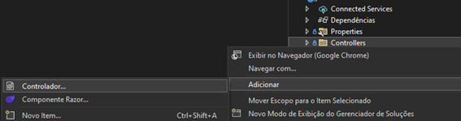
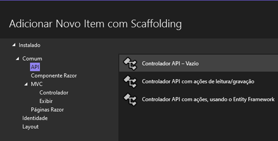
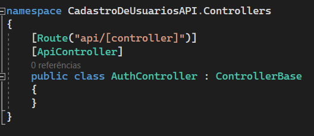

# Autenticação com JWT

Este tutorial tem como objetivo fornecer um guia detalhado sobre como adicionar autenticação a um Backend C# e ao Frontend React. Neste passo a passo, você aprenderá todas as etapas necessárias para implementar um sistema de autenticação JWT, permitindo que seus usuários acessem sua API por meio de autenticação adequada. Ao seguir este tutorial, você poderá criar uma aplicação robusta e bem protegida, garantindo a segurança e a privacidade dos dados dos seus usuários. Vamos começar agora mesmo!


Para realizar este tutorial, você pode utilizar seu próprio projeto existente ou utilizar um projeto de exemplo fornecido no seguinte link: [LINK AQUI].

## Configurando a API

Se você já possui uma API C# básica com classes DTO, DAO e Controller em uso, iremos agora adicionar o código e as configurações necessárias para habilitar a autenticação em nosso projeto.

O primeiro passo é adicionar a configuração JWT global da API. Esse código será responsável por validar todos os tokens recebidos pela API e determinar se eles são válidos ou não, mas atenção, esse código pode variar com a versão do dotnet que está em uso. Confira sua versão de projeto antes de executar o próximo passo. 

### .NET 5.0 ou superior
	
Caso seu projeto esteja na versão 5.0 ou superior, você deve fazer a configuração global de sua API no arquivo program.cs, na raiz de seu projeto. Para isso, abra o arquivo e no início do código você verá a seguinte linha:

    var builder = WebApplication.CreateBuilder(args);

Após essa linha, adicione o código a seguir:

```c#

var secretKey = "PU8a9W4sv2opkqlOwmgsn3w3Innlc4D5";
var key = new SymmetricSecurityKey(Encoding.UTF8.GetBytes(secretKey));
builder.Services.AddAuthentication(JwtBearerDefaults.AuthenticationScheme)
    .AddJwtBearer(options =>
    {
        options.TokenValidationParameters = new TokenValidationParameters
        {
            ValidateIssuerSigningKey = false, 
            IssuerSigningKey = key,
            ValidateIssuer = false, 
            ValidateAudience = false,
            ValidateLifetime = true, //Valida se o token está expirado
            ClockSkew = TimeSpan.Zero //Configura margem de tempo para validar expiração, caso queira uma margem de tempo, pode remover essa linha
        };
    }); 

```

Por fim, no final do arquivo e antes da linha **app.Run();**, adicione a linha a seguir:

``` C#
    app.UseAuthorization();
```

Não esqueça de adicionar a importação a seguir:

```c#
    using Microsoft.AspNetCore.Authentication.JwtBearer;
```

### .NET 3.1 ou inferior

Caso seu projeto esteja na versão 3.1 ou inferior, você deve fazer a configuração global de sua API no arquivo **startup.cs**, na raiz de seu projeto. Para isso, abra o arquivo e você poderá ver a função **“ConfigureServices”**. Dentro desse método, em sua primeira linha adicione o código a seguir, sem remover a linha que já existe:

```C#
var secretKey = "PU8a9W4sv2opkqlOwmgsn3w3Innlc4D5";
var key = new SymmetricSecurityKey(Encoding.UTF8.GetBytes(secretKey));

services.AddAuthentication(options =>
{
	options.DefaultAuthenticateScheme = JwtBearerDefaults.AuthenticationScheme;
	options.DefaultChallengeScheme = JwtBearerDefaults.AuthenticationScheme;
})
.AddJwtBearer(options =>
{
	options.TokenValidationParameters = new TokenValidationParameters
	{
		ValidateIssuerSigningKey = false,
		IssuerSigningKey = key,
		ValidateIssuer = false,
		ValidateAudience = false,
		ValidateLifetime = true, // Habilitar a validação de expiração do token
		ClockSkew = TimeSpan.Zero // Definir a margem de tempo zero para a //validação do tempo de expiração

	};
});

```

Depois, navegue até o método “Configure” e antes da linha de código **“app.UseMvc()”**, adicione o código.
    
    app.UseAuthentication(); 

Não esqueça de adicionar a importação a seguir:

    using Microsoft.AspNetCore.Authentication.JwtBearer;

## Entendendo a configuração global de autenticação

Vamos agora compreender melhor essa configuração e o código relacionado. Na primeira linha, você notou que utilizamos uma variável chamada "SecretKey". Mas o que exatamente isso representa?

A "SecretKey" é uma chave secreta, ou seja, uma sequência de caracteres confidencial, que é usada para assinar e verificar a autenticidade dos tokens JWT. Essa chave é compartilhada entre o emissor (quem gera o token) e o receptor (quem valida o token). Ao gerar um token JWT, o emissor utiliza essa chave secreta para assinar o token, garantindo que ele não seja alterado durante a transmissão. O receptor, por sua vez, utiliza a mesma "SecretKey" para verificar a assinatura do token e validar sua autenticidade.

A importância da "SecretKey" reside na segurança do sistema de autenticação baseado em JWT. Ela deve ser mantida em sigilo absoluto, conhecida apenas pelos componentes autorizados do sistema. Uma "SecretKey" forte e única é essencial para evitar a manipulação ou falsificação dos tokens JWT, garantindo a integridade e a autenticidade das informações transmitidas. Portanto, a "SecretKey" é uma peça fundamental na segurança do processo de autenticação JWT.
Para criar sua “SecretKey” única você pode utilizar o site https://workat.tech/developer-tools/sha256-hash-generator ou qualquer outro gerador de hashes Sha256.

## Realizando Login e gerando JWT

Para estruturar o processo de login e geração do JWT, vamos criar uma nova controller chamada AuthController. Essa controller terá a responsabilidade de lidar com o código relacionado à autenticação. Através dessa controller, vamos implementar as rotas e métodos necessários para realizar a autenticação do usuário e gerar o token JWT. Essa separação de responsabilidades nos permite manter um código mais organizado e modular, facilitando a manutenção e extensão do sistema de autenticação.

### Criando controller

Para isso, clique com o lado direito do mouse em nossa pasta “Controller”, depois clique em adicionar e depois “Controlador”.  



Depois adicione um controlador API Vazio, como na imagem abaixo:



Dê a ela o nome de AuthController.cs.
O resultado deverá ser como o seguinte:



### Criando Endpoint

Agora, é necessário criar um Endpoint específico para o Login. Esse Endpoint, uma função integrada à Controller, terá a finalidade de receber os dados de entrada do usuário, como nome de usuário, e-mail, CPF, etc., bem como a senha correspondente. Em seguida, a função será responsável por validar essas credenciais por meio das informações cadastradas no banco de dados. Por fim, se as credenciais forem consideradas válidas, o sistema deverá gerar um token e enviá-lo de volta ao usuário.

As configurações HTTP do nosso Endpoint são:

* Método: POST;
* Rota: /auth/login
* Corpo: DTO com dado de entrada do usuário e senha

No entanto, na nossa função de login, a maneira de passar os dados de login será um pouco diferente do que estamos acostumados. Em vez de usar JSON, iremos utilizar o formato x-www-form-urlencoded. Essa abordagem é mais adequada para dados de formulário simples e planos, pois não exige a complexidade adicional das estruturas hierárquicas do JSON.

Para utilizar essa forma, é necessário adicionar a tag "[FromForm]" antes da declaração do objeto UsuarioDTO, como ilustrado na imagem a seguir.

```C#
[HttpPost]
[Route("Login")]
public IActionResult Login([FromForm] UsuarioDTO dadosLogin)
{

}
```

Ótimo! Agora que nosso endpoint já possui suas configurações de HTTP prontas, o próximo passo é validar as credenciais do usuário e garantir que elas correspondam aos dados existentes em nosso banco de dados. Para isso, iremos criar uma função na classe UsuarioDAO, chamada "Login", que será responsável por acessar a base de dados e realizar uma consulta. Essa função receberá a mesma DTO de usuário com os dados de login como parâmetro e retornará a mesma DTO, porém com todos os dados pertinentes, como CPF, Nome, ID e outros, mas é recomendado não retornar a senha nessa DTO.

### Criando função login na DAO

Esse método da DAO é bem similar ao que estamos acostumados, com a diferença é que os parâmetros de busca da query serão “usuário e senha”, da seguinte forma:

```sql
SELECT*FROM Usuarios WHERE Email = @email AND Senha = @senha
```

Portanto o método inteiro ficará da seguinte maneira:

``` C#

        public UsuarioDTO Login(UsuarioDTO dadosLogin)
        {
            var conexao = ConnectionFactory.Build();
            conexao.Open();

            var query = "SELECT*FROM Usuarios WHERE Email = @email AND Senha = @senha";

            var comando = new MySqlCommand(query, conexao);
            comando.Parameters.AddWithValue("@email", dadosLogin.Email);
            comando.Parameters.AddWithValue("@senha", dadosLogin.Senha);

            var dataReader = comando.ExecuteReader();

            var usuario = new UsuarioDTO();
            while (dataReader.Read())
            {
                usuario.ID = int.Parse(dataReader["ID"].ToString());
                usuario.Nome = dataReader["Nome"].ToString();
                usuario.Email = dataReader["Email"].ToString();
                usuario.CPF = dataReader["CPF"].ToString();
                usuario.Celular = dataReader["Celular"].ToString();
                usuario.Imagem = dataReader["Imagem"].ToString();
            }
            conexao.Close();

            return usuario;
        }

```

Aprimoramos o nosso código para validar as credenciais do usuário. Agora, vamos retornar à controller e implementar a validação das credenciais no endpoint de login.

No nosso endpoint (método login dentro do **AuthController**), iremos adicionar um objeto **UsuarioDAO** e utilizá-lo para validar as credenciais.

```C#
var dao = new UsuarioDAO();
```

Em seguida, chamaremos a função **Login**, passando as credenciais do usuário, e armazenaremos o resultado em uma variável chamada **usuario**.

```c#
var dao = new UsuarioDAO();
var usuario = dao.Login(dadosLogin);
```

Agora, é necessário validar se o usuário foi encontrado no banco de dados e se suas credenciais são válidas. Para realizar essa validação, basta verificar se a variável usuario possui um ID diferente de zero. Se o ID for diferente de zero, isso indica que os dados do usuário foram encontrados na base de dados.

``` c#
var dao = new UsuarioDAO();
var usuario = dao.Login(dadosLogin);

if(usuario.ID == 0)
{
    //Usuário não encontrado
    return NotFound("Usuário e/ou senha inválidos");
}
// Usuário encontrado!
return Ok();
```

### Gerando Token JWT

Agora, de acordo com o nosso fluxo de autenticação, precisamos gerar um **Token JWT** para retornar ao usuário, juntamente com dados relevantes para a sua aplicação, como ID, E-mail, nome, entre outros.

Para isso, vamos criar na controller um método, mas não um endpoint, para gerar o Token, seu nome pode ser algo como GenerateJwtToken e para funcionar adequadamente, esse método precisa dos dados do usuário e da SecretKey, a mesma que utilizamos na configuração global da autenticação e seu tipo de retorno deverá ser uma string, para retornarmos dessa função o token que foi gerado.  

```C#
private string GenerateJwtToken(UsuarioDTO usuario, string secretKey)
{

}
```

De forma bem similar ao que fizemos na configuração global, vamos criar variáveis para a SecretKey

```C#
var key = new SymmetricSecurityKey(Encoding.UTF8.GetBytes(secretKey));
var credentials = new SigningCredentials(key, SecurityAlgorithms.HmacSha256);
```

Depois, vamos criar uma lista de Claims, uma "claim" em um JWT é uma afirmação sobre uma entidade (como um usuário) que é incluída no token. Ela representa uma informação específica e pode conter diversos tipos de dados, como o nome, e-mail, papel/permissões do usuário, ou qualquer outra informação relevante para a aplicação.

Em resumo, a claim vai ser a responsável por transportar os dados pertinentes para a aplicação utilizar e garantir qual usuário gerou e esta utilizando aquele token

Para criar esse código a sintaxe é a seguinte:

``` c#
var claims = new List<Claim>
{
    new Claim("ID", usuario.ID.ToString())
}
```

Nesse caso estamos retornando somente o ID do usuário, mas caso nosso sistema necessite de outros dados como nome e CPF basta adicionar abaixo do ID, como no exemplo abaixo:

``` c#
var claims = new List<Claim>
{
    new Claim("ID", usuario.ID.ToString()),
    new Claim("Email", usuario.Email),
    new Claim("CPF", usuario.CPF)
}
```

Agora com as variáveis de SecretKey e claims criadas, precisamos gerar o token:

```C#
var token = new JwtSecurityToken(
    "APIUsuarios", //Nome da sua api
    "APIUsuarios", //Nome da sua api
    claims, //Lista de claims
    expires: DateTime.UtcNow.AddDays(1), 
    //Tempo de expiração do Token, nesse caso o Token expira em um dia
    signingCredentials: credentials
);

return new JwtSecurityTokenHandler().WriteToken(token);
```

Pronto, com esse código estamos aptos a gerar um JWT válido e retornar para o usuário, o método inteiro ficou da seguinte forma:

```C#
private string GenerateJwtToken(UsuarioDTO usuario, string secretKey)
{
    var key = new SymmetricSecurityKey(Encoding.UTF8.GetBytes(secretKey));
    var credentials = new SigningCredentials(key, SecurityAlgorithms.HmacSha256);

    var claims = new List<Claim>
    {
        new Claim("ID", usuario.ID.ToString()),
        new Claim("Email", usuario.Email),
        new Claim("CPF", usuario.CPF)
    }

    var token = new JwtSecurityToken(
        "APIUsuarios", //Nome da sua api
        "APIUsuarios", //Nome da sua api
        claims, //Lista de claims
        expires: DateTime.UtcNow.AddDays(1), 
        //Tempo de expiração do Token, nesse caso o Token expira em um dia
        signingCredentials: credentials
    );

    return new JwtSecurityTokenHandler().WriteToken(token);
}
```

Agora podemos retornar ao endpoint de Login e utilizar a função de gerar token que criamos.

Nosso endpoint de login deve ter a seguinte forma no momento:

```c#

[HttpPost]
[Route("Login")]
public IActionResult Login([FromForm] UsuarioDTO dadosLogin)
{
    var dao = new UsuarioDAO();
    var usuario = dao.Login(dadosLogin);

    if(usuario.ID == 0)
    {
        //Usuário não encontrado
        return NotFound("Usuário e/ou senha inválidos");
    }
    // Usuário encontrado!
    return Ok();
}

```

Agora, caso o usuário tenha sido encontrado, precisamos gerar seu token e retorna-lo para o usuário, para isso, basta chamar a função que criamos e armazenar seu resultado em uma variável chamada "token" e depois retorna-lá dentro do status code Ok().

```C#
var token = GenerateJwtToken(usuarioLogado, "PU8a9W4sv2opkqlOwmgsn3w3Innlc4D5");
return Ok(new { token });
```

No fim desse processo, seu endpoint deverá ter essa forma:

```c#

[HttpPost]
[Route("Login")]
public IActionResult Login([FromForm] UsuarioDTO dadosLogin)
{
    var dao = new UsuarioDAO();
    var usuario = dao.Login(dadosLogin);

    if(usuario.ID == 0)
    {
        //Usuário não encontrado
        return NotFound("Usuário e/ou senha inválidos");
    }
    // Usuário encontrado!
    var token = GenerateJwtToken(usuarioLogado, "PU8a9W4sv2opkqlOwmgsn3w3Innlc4D5");
    return Ok(new { token });
}
```

 Caso você gere sua própria SecretKey, certifique-se de atualiza-lá tanto na geração do token quanto na configuração de autenticação global de sua API.