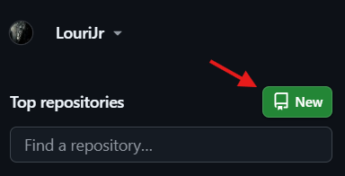
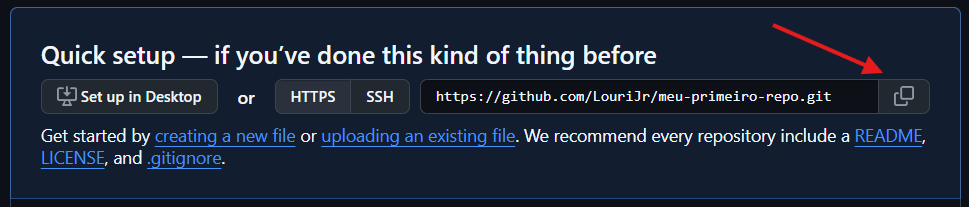
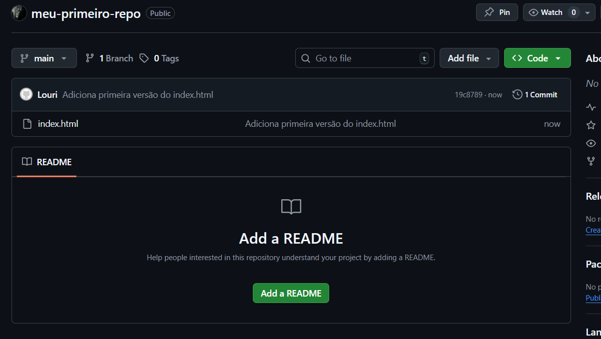
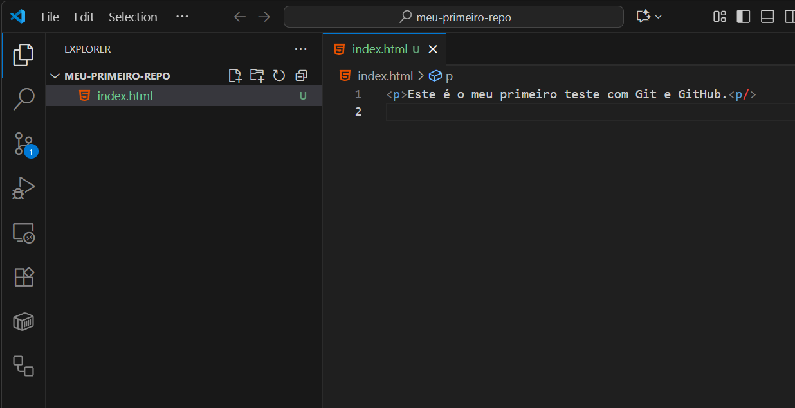
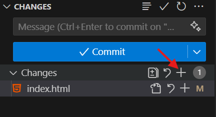
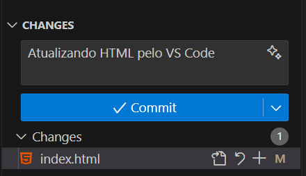
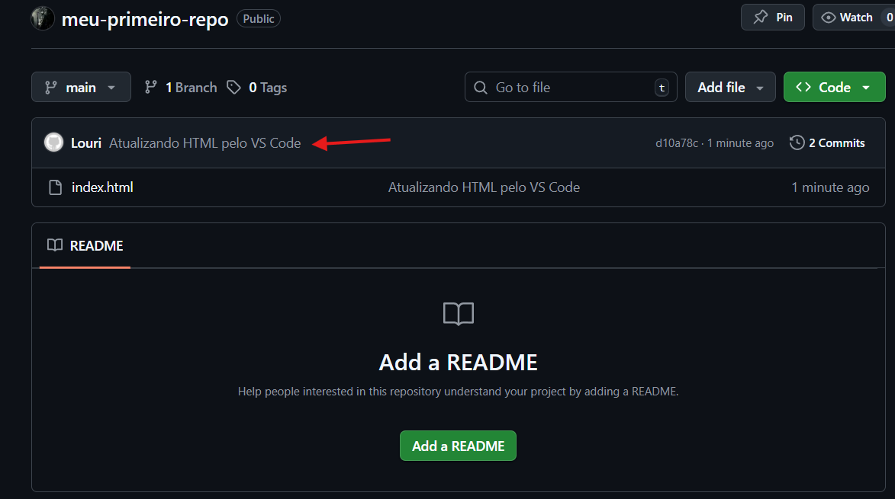

## 📌 Tutorial Prático de Git + GitHub

### **1 – Crie uma conta no GitHub**

Entre no site [https://github.com](https://github.com/) e crie sua conta gratuita.  
O GitHub será a plataforma onde você vai hospedar seus repositórios e compartilhar código com outras pessoas.

### **2 – Crie um repositório remoto no GitHub**

Depois de logado, clique em **“New Repository”** ~~ou algo similar~~.  
Dê um nome ao seu projeto (ex: `meu-primeiro-repo`) e mantenha como **público**.  
Não precisa adicionar README agora, vamos criar o repositório vazio.



### **3 – Abra o terminal na pasta onde deseja trabalhar**

Escolha no seu computador uma pasta para armazenar o projeto.  
Abra o **terminal** dentro dessa pasta (no Windows, pode usar **Shift + botão direito → Abrir no terminal**).

### **4 – Clone o repositório**

No GitHub, copie o link HTTPS do repositório que você criou.  
Para isso, você pode clicar no icone abaixo:



Em seguida, volte ao terminal e digite:

```
git clone https://github.com/seu-usuario/meu-primeiro-repo.git
```

Ao executar, isso criará uma cópia do repositório remoto na sua máquina.

Quando executar esse comando, você deve navegar até a pasta do seu repositório local no seu terminal, pois o git no terminal ~~e em qualquer lugar~~ só funciona se estiver na pasta correta

Para isso, digite "cd nome-do-seu-repositorio" no terminal e dê enter

``` bash
cd nome-do-seu-repositorio
```


### **5 – Configure o Git (apenas na primeira vez)**

É necessário informar ao Git quem é você.  
Isso só precisa ser feito **uma única vez por computador**:

Para isso, ainda no terminal, primeiro configure seu nome:

```
git config --global user.name "Seu Nome"
```

Depois, configure seu e-mail

```
git config --global user.email "seu@email.com"
```

Assim, cada commit terá seu nome e email.

### **6 – Edite um arquivo no Visual Studio Code**

Abra a pasta clonada no **VS Code**.  
Crie ou edite um arquivo, por exemplo `index.html`, e escreva algo simples como:

```
<p>Este é o meu primeiro teste com Git e GitHub.</p>
```

### **Cheque o status do seu repositório**

No terminal, digite:

```
git status
```

### **7 – Adicione o arquivo (git add)**

No terminal, digite:

```
git add .
```

Esse comando envia as mudanças para a staging area, preparando os arquivos para serem commitados.

### **Cheque novamente o status do seu repositório**

Agora com a alteração, vale a pena checar novamente o status do seu repo

No terminal, digite:

```
git status
```

### **8 – Crie um commit**

Agora registre a alteração no histórico:

```
git commit -m "Adiciona primeira versão do index.html"
```

A mensagem deve **explicar resumidamente o que foi feito**.

### **9 – Envie para o GitHub (git push)**

Por fim, envie suas alterações do repositório local para o remoto:

```
git push
```

Agora seu arquivo já está disponível no GitHub!

## 📌 Trabalhando no VsCode

Além do terminal, o Visual Studio Code oferece uma integração nativa com o Git que facilita bastante o trabalho.
Com ele, é possível ver as alterações, preparar commits, sincronizar com o GitHub e até resolver conflitos, tudo de forma visual e intuitiva.
Isso torna o fluxo mais rápido e acessível, especialmente para quem está começando.


Ao finalizar a etapa anterior, seu GitHub deve ter a aparência a seguir:



E seu VsCode a aparência a seguir:



### **1 – Faça uma alteração no seu html**

Edite seu arquivo existente (index.html) com a estrutura de um html

``` html
<!DOCTYPE html>
<html lang="en">
<head>
    <meta charset="UTF-8">
    <meta name="viewport" content="width=device-width, initial-scale=1.0">
    <title>Meu primeiro Repo</title>
</head>
<body>
    <p>Este é o meu primeiro teste com Git e GitHub.</p>
</body>
</html>
```

### **2 – Abrindo o menu do git no VsCode**

Clique no menu do Git no seu editor de texto


### **3 – Adicione sua alteração à Staging Area**

-   Clique no ícone **“+”** ao lado do arquivo para adicioná-lo.
-   Isso equivale ao comando `git add`.



### **4 – Crie o commit**

No campo de texto que aparece no topo do painel, escreva uma mensagem de commit.  
Exemplo:



-   Clique no ícone de **check (✓)** para confirmar.
-   Isso equivale ao `git commit -m "mensagem"`.

### **5 – Envie para o GitHub**

-   Clique em **… (More Actions)** no canto superior do painel → **Push**.
    
-   Ou use o botão **Sync Changes** que aparece no rodapé.
    
-   Isso envia as mudanças para o repositório remoto no GitHub.
    

* * *

### **6 – Veja o resultado**

-   Vá até o seu repositório no **GitHub**.
    
-   Atualize a página e você verá que o commit já está disponível online.



Note que a mensagem do commit está atualizada e ao navegar ao seu HTML ele deve estar com as ultimas alterações realizadas.
