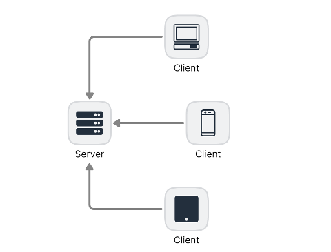

# Programação WEB II

## Introdução

### O que é a Web

A Web, ou World Wide Web (WWW), é uma rede global de documentos e recursos interligados, acessíveis através da Internet. A Web foi criada em 1989 por Tim Berners-Lee, e desde então, tornou-se uma das mais importantes tecnologias da era digital.

A Web é composta por páginas da web, que são documentos HTML (Hypertext Markup Language) e podem incluir texto, imagens, vídeos, links e outros recursos interativos. Estas páginas são hospedadas em servidores na Internet e são acessíveis através de um navegador web, como o Google Chrome, o Mozilla Firefox ou o Safari.

A Web permite que pessoas de todo o mundo compartilhem informações, colaborem em projetos e acessem recursos em um ambiente global e interconectado. A Web também possibilitou a criação de aplicações dinâmicas e interativas, como redes sociais, e-commerces, jogos e muito mais.

### Arquitetura Cliente-Servidor

A arquitetura cliente-servidor é um modelo de computação distribuída que divide a funcionalidade de uma aplicação entre dois componentes principais: o cliente e o servidor.

O cliente é responsável por apresentar a interface do usuário e realizar requisições ao servidor, enquanto o servidor é responsável por armazenar e processar dados, bem como fornecer respostas às requisições do cliente.

Esta arquitetura é amplamente utilizada em aplicações web, onde o cliente é o navegador web e o servidor é o servidor web. Quando o usuário acessa uma página da web, o navegador envia uma requisição HTTP ao servidor, que responde enviando o conteúdo da página.

A arquitetura cliente-servidor também é comum em aplicações de banco de dados, onde o cliente é a aplicação que acessa o banco de dados e o servidor é o próprio banco de dados.



## Introdução ao Javascript

### O que é o Javascript

JavaScript é uma linguagem de programação de propósito geral, dinâmica e interpretada. É uma das linguagens de programação mais amplamente utilizadas na web, pois é a linguagem principal usada para criar aparências e comportamentos interativos em páginas da web. Além disso, o JavaScript é usado para desenvolver aplicativos para desktop e dispositivos móveis, bem como para construir backends de aplicativos web.

A principal característica do JavaScript é a sua capacidade de manipular objetos em páginas da web, o que o torna útil para criar efeitos visuais, validação de formulários, comunicação assíncrona com servidores e muito mais. Ele é executado diretamente no navegador do usuário, tornando possível criar aplicações da web altamente interativas sem a necessidade de recarregar a página.

Outra característica importante do JavaScript é que ele é uma linguagem de programação orientada a objetos, o que significa que permite a criação de objetos e a definição de suas propriedades e métodos. Isso permite a reutilização de código e a organização de lógica em uma estrutura hierárquica.

Além disso, o JavaScript é uma linguagem de programação assíncrona, o que significa que pode realizar várias tarefas ao mesmo tempo sem bloquear a execução do resto do código. Isso é importante para garantir que a página da web continue sendo responsiva mesmo quando o navegador está realizando tarefas pesadas.

O JavaScript também é uma linguagem de programação baseada em eventos, o que significa que ele é executado sempre que um evento específico ocorre, como cliques de mouse, toques em tela ou carregamento de página. Isso permite a criação de aplicações altamente interativas que respondem a ações do usuário.

### História do Javascript

O JavaScript foi criado em 1995 e foi projetado para ser uma linguagem de scripting simples e fácil de usar, que pudesse ser usada para adicionar interatividade e dinamismo às páginas da web.

Na época, a web era relativamente nova e as páginas eram estáticas, o que significava que a interatividade e a atualização de conteúdo tinham que ser feitas no lado do servidor. O JavaScript mudou isso, permitindo a criação de aplicações client-side que podiam interagir com o usuário e atualizar a página sem precisar recarregar a página inteira.

Desde então, o JavaScript evoluiu muito e hoje é uma das linguagens de programação mais populares e amplamente utilizadas do mundo. Ele é suportado por todos os principais navegadores e é mantido pela comunidade de desenvolvedores e empresas como a Mozilla, Google e Microsoft.

### Javascript NÃO é Java

Embora o nome possa sugerir isso, o JavaScript e o Java são duas linguagens de programação completamente diferentes. O JavaScript foi originalmente chamado Mocha e depois mudou para LiveScript, antes de ser renomeado para JavaScript para capitalizar o sucesso do Java na época.

O JavaScript é uma linguagem de programação de script dinâmica, que é executada diretamente no navegador do usuário. Ele é usado para adicionar interatividade e dinamismo às páginas da web e é muito versátil, permitindo a criação de aplicações client-side, servidor-side (através do Node.js) e aplicativos móveis.

Já o Java é uma linguagem de programação orientada a objetos, que é compilada e executada em uma máquina virtual. Ele é usado para criar aplicativos de desktop, aplicativos de servidor e aplicativos móveis de alta performance.

### Similaridades e Diferenças entre C# e Javascript

C# e JavaScript são duas linguagens de programação distintas, cada uma com suas próprias características e usos específicos. Algumas das principais similaridades e diferenças entre C# e JavaScript incluem:

#### Similaridades 

* Suporte para operadores aritméticos e lógicos. 
* Suporte para estruturas de controle de fluxo como if/else, switch, for, while etc. 
* Suporte para funções e métodos. 
* Suporte para arrays e objetos. 
* Sintaxe semelhante para atribuição de valores a variáveis.

#### C#

```Javascript
public void MaiorDeIdade()
{
    int idade = 18;

    if(idade > 17)
    {
        Console.WriteLine("Maior de idade");
    }
    else
    {
        Console.WriteLine("Menor de idade");
    }
}
```

#### Javascript

``` Javascript
function MaiorDeIdade()
{
    let idade = 18;

    if(idade > 17) {
        console.log("Maior de idade");
    }
    else {
        console.log("Menor de idade");
    }
}
```

#### Diferenças

* C# é uma linguagem fortemente tipada, enquanto o JavaScript é uma linguagem fracamente tipada. Isso significa que C# exige que você declare o tipo de dados de cada variável, enquanto o JavaScript não o faz. 

* C# é compilada para uma máquina virtual, enquanto o JavaScript é interpretado diretamente pelo navegador. 

* C# é uma linguagem síncrona, enquanto o JavaScript é uma linguagem assíncrona. Isso significa que o C# executa tarefas de forma sequencial, enquanto o JavaScript executa tarefas de forma paralela. 