# Tutorial - Primeiro aplicativo React

O projeto criado em nossa apostila será uma aplicação para listar usuários de uma base de dados, para isso iremos criar um projeto React, uma API em C# e realizaremos uma conexão com um banco de dados MySQL, o script da criação da tabela será disponibilizado.

## Criando um projeto React (Front-end)

Como visto em outras aulas, o create-react-app é o comando que iremos utilizar para criar o projeto React, para isso, siga os passos a seguir:

Primeiro, abra o terminal (cmd) em uma pasta desejada onde o projeto será criado:

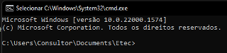

Com o terminal aberto iremos executar o seguinte comando:

```
npx create-react-app listagem-de-usuarios 
```

Caso o comando não funcione da forma adequada, tente executar o seguinte comando e torne a executar o comando “create-react-app”

```
npm install -g create-react-app 
```

Agora com os arquivos iniciais de nosso projeto, precisamos abrir a pasta em nosso editor de arquivo, porém, **note que a pasta que deve ser aberta em nosso editor é a pasta criada pelo comando create-react-app, ou seja, a pasta com o nome do nosso projeto.**

Para abrir uma pasta no Visual Studio Code, acesse o menu Arquivo (File) e depois a opção Abrir Pasta (Open Folder) e selecione a pasta com o nome do projeto.

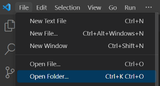

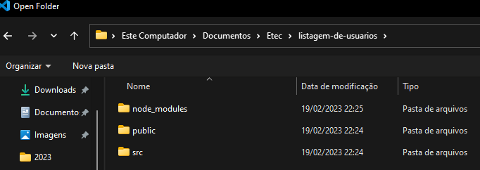

Figura 1 - Pasta selecionada

Em seguida, agora com a pasta aberta, abra um terminal com o atalho CLTR + ‘ (aspa simples) ou clique no menu terminal e depois em “novo terminal”

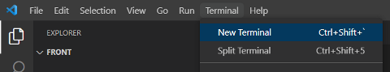

```
npm start
```

Ao seguir os passos anteriores, o resultado esperado é que abra seu navegador com a seguinte aparência:


### Estrutura de arquivos

Ao criar o projeto, você pode notar que alguns arquivos foram criados em sua pasta, esses arquivos são o que compõe a base de nosso projeto, incluindo essa página inicial, que vimos no navegador.

Os arquivos devem ter a seguinte aparência:

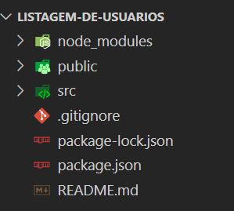

Nossa estrutura de arquivos para o projeto React será bem simples, vamos centralizar nossos códigos dentro da pasta “src”, onde vamos criar uma pasta chamada “Components” e vamos adicionar nossos componentes posteriormente.

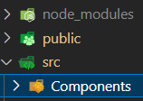

### Criando nosso primeiro componente

Como visto anteriormente, os componentes são forma de organizar projeto para facilitar a reutilização de código e atomização de manutenções, para isso utilizaremos o JSX.

Para organizar os componentes do nosso projeto com a fim de otimizar e organizar nosso desenvolvimento, criaremos uma pasta para cada componente. O propósito de nosso projeto é listar usuários, vamos começar criando um componente que exiba na tela os dados de um usuário.

Para isso, crie dentro da pasta “Componentes”, uma pasta com o nome “CardUsuario”, card é um conceito que aplicamos no front-end para agrupar na tela os dados de uma determinada entidade.

AAAAAAAAAAAAAAAAAAAAAAAAA
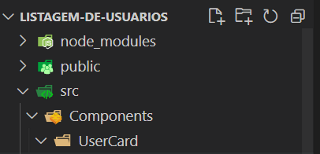

Caso sua pasta esteja com a visualização no formato linear, como na imagem a seguir, sugiro que vá às configurações de pasta e remova a opção “Compact Folders”. Caso não esteja, você deve ignorar a próxima instrução.

AAAAAAAAAAAAAAAAAAAAAAA
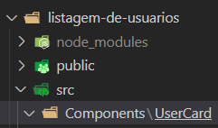

Para acessar a opção “Compact Folder” você deve acessar os menus:

Arquivo (File) -> Preferências (Preferences) -> Configurações (Settings)

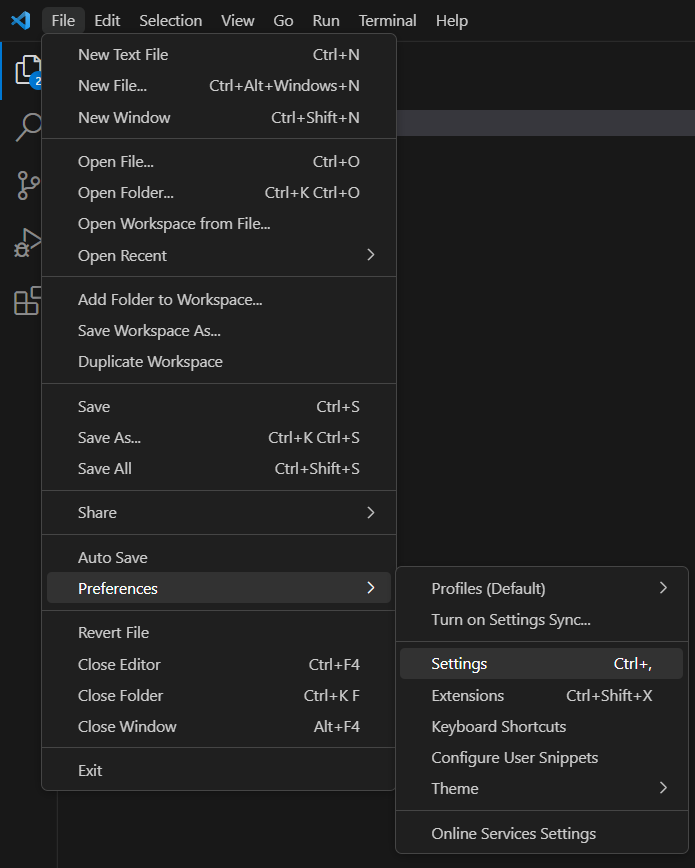

Após abrir a janela de configurações, no campo de busca digite: “compact” e desmarque a primeira opção.

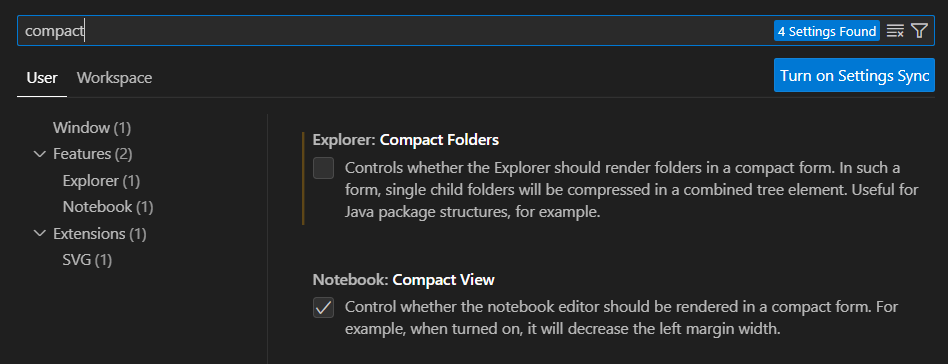

Voltando ao nosso componente, precisamos criar dentro de nossa pasta “CardUsuario” o arquivo JSX que irá compor nosso componente, para isso clique com o lado direito do mouse na pasta e selecione a opção “Novo Arquivo”, o nome do arquivo deve ser “CardUsuario.jsx”.

 Com o arquivo em branco, podemos iniciar a criação de nosso JSX, sua sintaxe, como visto anteriormente, devera inicialmente parecer com a seguinte imagem:

``` JSX
function CardUsuario() {
  return (
    <div></div>
  )
}

export default CardUsuario;

```

Note que existe uma div em nosso componente, ou seja, um componente HTML, dentro dessa div vamos codificar e estilizar o conteúdo do nosso componente React.

A princípio, vamos criar um componente simples que exibe em tela o nome e o email de uma pessoa.

```JSX
function CardUsuario() {
  return (
    <div>
      <p>Nome: Lourival Cicero</p>
      <p>Email: lourival@gmail.com</p>
    </div>
  );
}

export default CardUsuario;

```

### Utilizando nosso componente

No passo anterior criamos nosso componente, mas note que ainda não utilizamos este componente em nossa aplicação, para utilizar o componente precisamos alterar o arquivo raiz e “chamar” este componente.

Vamos até o arquivo App.Js, localizado na raiz da pasta “src”

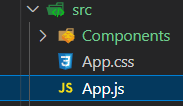

Ao abrir este código, podemos notar que ele é o responsável por exibir aquela tela inicial que vemos ao iniciar a nossa aplicação React:  

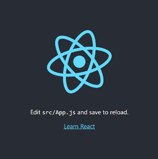

``` JSX
import logo from './logo.svg';
import './App.css';

function App() {
  return (
    <div className="App">
      <header className="App-header">
        
        <p>
          Edit <code>src/App.js</code> and save to reload.
        </p>
        <a
          className="App-link"
          href="https://reactjs.org"
          target="_blank"
          rel="noopener noreferrer"
        >
          Learn React
        </a>
      </header>
    </div>
  );
}

export default App;


```

Dentro do nosso código há uma imagem, que representa o logo do React, seguido de uma tag *< p >*, com o texto exibido abaixo do logo.

Como nossa intenção é exibir os dados do usuário, vamos inicialmente remover todo esse conteúdo de dentro do nosso arquivo App.js.

Ao fim deste processo seu código deve ter a aparência a seguir:

``` JSX
import './App.css';

function App() {
  return (
    <div>
      
    </div>
  );
}

export default App;

```

Gosto de pensar que criar componentes React com JSX é como criar minhas próprias tags HTML, porém com muito mais ações, estilos e consequentemente muito mais possibilidades.

Então podemos entender que nosso componente “CardUsuario” é uma nova tag e ao referenciá-la em nosso código, exibiremos o nome e a email da pessoa, mas antes, para utilizar a nossa tag personalizada, precisamos importá-la para dentro de nosso arquivo.

Adicione o código a seguir na primeira linha do arquivo App.js

```
import CardUsuario from "./Components/CardUsuario/CardUsuario"; 
```

Esse código representa a importação de nossa tag para utilizarmos dentro desse arquivo App.js, durante seus estudos em React você irá notar que importações e exportações são muito comuns para acessarmos e compartilharmos arquivos entre nosso projeto.

Após importar o arquivo devemos adicionar nossa tag personalizada dentro de nossa div, ao fim do processo seu código deverá parecer com o código a seguir:

``` JSX
import "./App.css";
import CardUsuario from "./Components/CardUsuario/CardUsuario";

function App() {
  return (
    <div>
      <CardUsuario></CardUsuario>
    </div>
  );
}

export default App;

```

Ao salvar o arquivo, vá até o navegador onde sua aplicação React está aberta, lá você poderá notar que o nome e email escritos dentro do componente aparecerá em sua tela.

### Adicionando CSS em nosso componente

Existem diversas maneiras de trabalhar com CSS em nosso componente React como Estilização inline, bibliotecas CSS e arquivos CSS. Nessa apostila a abordagem adotada será o CSS Modules.

#### O que é CSS Modules

CSS Modules é uma abordagem no desenvolvimento de aplicações React que permite o encapsulamento e modularização do CSS, evitando conflitos e promovendo uma melhor organização e reutilização dos estilos. Com o CSS Modules, cada componente tem seu próprio escopo de estilos, tornando mais fácil o desenvolvimento e manutenção de projetos, além de proporcionar uma maior legibilidade e escalabilidade no código CSS.

Utilizar CSS Modules em um componente React pode ser bem similar com utilizar CSS em um arquivo HTML, com a vantagem de que, assim como “atomizamos” os componentes HTML, também vamos deixar nossos arquivos CSS cada vez menores e com responsabilidades mais direcionadas.

Para adicionar um arquivo CSS crie um arquivo na pasta do componente que deseja estilizar, o padrão de nome que vamos adotar é nomear o arquivo CSS com o mesmo nome do componente React, seguido da palavra **module** e por fim a extesão css, tudo isso separado por pontos, como no exemplo a seguir:

``` CardUsuario.module.css ```

AAAAAAAAAAAAAAAAAAAAAA
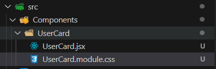

Agora vamos estilizar o componente, a sintaxe do CSS permanece a mesma que já conhecemos e trabalhamos anteriormente em PW I, aqui vai um CSS de exemplo para nosso CardUsuario.

``` CSS
.card {
    border: 1px solid;
    padding: 10px;
    box-shadow: 5px 10px #888888;
    width: 200px;
    margin: 10px 10px;
}
```

Criando o arquivo CSS, precisamos importar ele dentro de nosso componente JSX para declarar o seu uso, a importação desse arquivo é muito importante, pois sem ela esse CSS fica inacessível.

Para importar basta adicionar na primeira linha do arquivo JSX o seguinte código:

``` import styles from "./CardUsuario.module.css" ```

Com isso, criamos um objeto de importação chamado **styles** onde todas as classes CSS, criadas em nosso arquivo CSS Modules, podem ser refenciados.

#### Utilizando CSS Modules

Agora com nosso CSS importado, precisamos utilizá-lo em nosso componente, seu uso é muito similar ao uso no HTML convencional, com exceção da marcação “class” e do uso do objeto **styles**.

Para utilizar uma classe no CSS como a classe “card” que criamos, você deve utilizar a marcação “className” da seguinte maneira:

```JSX
import styles from "./CardUsuario.module.css";

function CardUsuario() {
  return (
    <div className={styles.card}>
      <p>Nome: Lourival Cicero</p>
      <p>Email: lourival@gmail.com</p>
    </div>
  );
}

export default CardUsuario;

```

Adicionando está classe em nosso arquivo JSX a aparência de nosso site deve ser similar a imagem a seguir:

AAAAAAAAAAAAAAAAAAAA
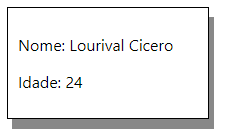

Agora com o HTML e CSS em mãos, sua criatividade é ilimitada, teste estilos e componentes diferentes para criar visuais interessantes e chamativos.

## Transportando dados para nosso componente (props)

### Hierarquia de componentes

Para falar de props e transporte de dados precisamos antes falar mais sobre nossa arquitetura. Na arquitetura de componentes do React, os componentes podem ser organizados em hierarquia, onde um componente pai pode conter vários componentes filhos. Cada componente é responsável por renderizar uma parte da interface do usuário e gerenciar seu próprio estado.

A hierarquia de componentes permite que você divida sua interface do usuário em partes menores e reutilizáveis, o que torna o desenvolvimento de aplicativos mais fácil e escalável. Além disso, também facilita a manutenção do código, já que você pode atualizar ou corrigir uma parte específica da interface do usuário sem afetar o resto da aplicação.

Hoje nossa hierarquia de componentes hoje está desenhada da seguinte forma:  

AAAAAAAAAA
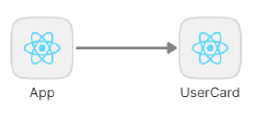

Ou seja, o componente App.JSX é pai do nosso componente CardUsuario.JSX.

### O que são as Props

Props em React é uma abreviação para "propriedades". É utilizado para passar dados de um componente pai para um componente filho. Props são imutáveis, ou seja, uma vez que são definidos, eles não podem ser alterados pelo componente filho. Eles funcionam como argumentos passados para uma função, onde o componente pai passa valores para as props e o componente filho os recebe como argumentos. Props são usados para compartilhar informações entre componentes e garantir que a interface do usuário seja renderizada corretamente.

Podemos imaginar o nosso componente React como uma espécie de formulário em branco, que precisa ser preenchido com dados dinâmicos, para preencher esses dados em branco o componente pai, ao chamar o componente filho, passa os dados via props.

Podemos enxergar as propriedades do componente como variáveis, assim, o componente exibirá dados dinâmicos, mudando de acordo com o que nós desejamos.
Essa explicação mais abstrata pode ficar mais objetiva se trabalharmos com exemplos reais.

### Exemplo de Props

Para configurar nosso componente filho para receber props precisamos especificar quais propriedades o componente precisa para funcionar. No caso do componente CardUsuario temos apenas duas propriedades: nome e email.

Para adicionar as propriedades basta adicionar os nomes no espaço para parâmetros de nosso componente (parenteses), como o código a seguir:

```JSX
import styles from "./CardUsuario.module.css";

function CardUsuario({nome, email}) {
  return (
    <div className={styles.card}>
      <p>Nome: Lourival Cicero</p>
      <p>Email: lourival@gmail.com</p>
    </div>
  );
}

export default CardUsuario;

```

Pronto! Nosso componente tem propriedades vindas do componente pai para o componente filho, mas ainda não estamos utilizando essas propriedades da forma adequada.

Como dito anteriormente, podemos enxergar as propriedades do componente como variáveis, assim, o componente exibirá dados dinâmicos, mudando de acordo com o que nós desejamos.

Para utilizar essas propriedades de nome e email precisamos fazer com o que nosso HTML dentro do JSX chame esses dados. Para isso, coloque o nome da variável entre chaves e o valor desse dado será apresentado na tela.

```JSX
import styles from "./CardUsuario.module.css";

function CardUsuario({nome, email}) {
  return (
    <div className={styles.card}>
      <p>Nome: {nome}</p>
      <p>Email: {email}</p>
    </div>
  );
}

export default CardUsuario;
```

 Note que agora que nosso componente está dinâmico, sua aparência se assemelha à um formulário em branco, esperando para ser preenchido.

AAAAAAAAA
 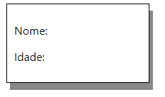

 Ao falar sobre props, mencionamos que o componente pai é o responsável de passar os dados para o componente filho, ou seja, para adicionar dados em nosso componente, precisamos acessar o componente pai e fazer a alteração necessária.

 No momento, o componente pai de nosso componente CardUsuario é o componente App.JSX, como vimos na imagem a seguir:

AAAAAAAAAAA


### Utilizando Props

Precisamos então acessar o arquivo App.JSX e na linha onde chamamos o componente CardUsuario precisamos fazer a devida alteração.

Adicionar propriedades em um componente filho é bem similar ao que utilizamos para passar alguns dados ou configurações para componentes HTML, por exemplo a propriedade Source (ou src) de uma tag IMG do HTML é escrita da seguinte forma:

```HTML

```

Para adicionar um dado nas propriedades de nosso componente não é muito diferente, basta adicionar o nome da propriedade e o valor desejado como na imagem a seguir:

``` JSX
import "./App.css";
import CardUsuario from "./Components/CardUsuario/CardUsuario";

function App() {
  return (
    <div>
      <CardUsuario nome="Lourival Cicero" email="lourival@gmail.com"></CardUsuario>
    </div>
  );
}

export default App;

```

Ao acessar novamente nosso site no navegador você deve notar que nosso card voltou a estar preenchido com os dados que adicionamos.

AAAAAAAAAA


Mas existe agora uma grande diferença entre nosso antigo componente e o componente atual: Nosso componente é dinâmico, ou seja, podemos criar vários componentes iguais, mas com nomes e emails diferentes:  

``` JSX
import "./App.css";
import CardUsuario from "./Components/CardUsuario/CardUsuario";

function App() {
  return (
    <div>
      <CardUsuario nome="Lourival Cicero" email="Lourival@email.com"></CardUsuario>
      <CardUsuario nome="João" email="João@email.com"></CardUsuario>
      <CardUsuario nome="Maria" email="Maria@email.com"></CardUsuario>
    </div>
  );
}

export default App;


```

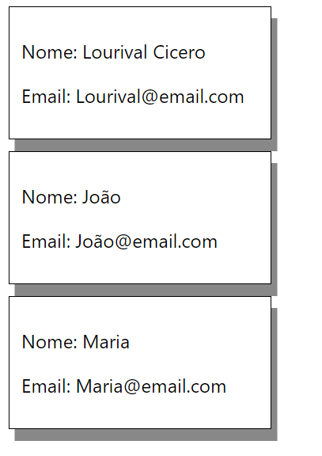

Com isso, temos uma estrutura básica em nosso front-end para criar uma listagem de usuários dinâmicas com dados de usuários preenchidos com informações do banco de dados, mas para isso, precisamos criar nosso back-end e realizar a integração de nossas aplicações.
