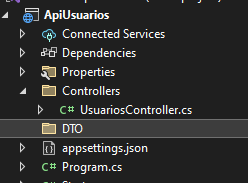
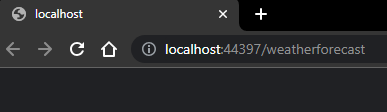

# Tutorial - Primeiro aplicativo React

Como vimos anteriormente, construiremos uma API com o propósito de acessar nossos dados de um banco de dados, integrar com nosso front-end React e exibi-las para o usuário.

# Arquitetura da aplicação

Para fins didáticos, iremos criar uma arquitetura de aplicação baseadas em 3 tipos de arquivos, são eles: Controller, DTO e DAO.

Separamos os arquivos para poder organizar a aplicação e poder delimitar melhor as responsabilidades de nosso código, tornando assim a manutenção mais simples e os códigos mais enxutos.

## Controller

O arquivo Controller é um componente responsável, em nossa arquitetura, pela lógica de controle e gerenciamento de dados e eventos da aplicação.

Ou seja, a Controller recebe as solicitações do usuário, interage com a DAO para executar as ações necessárias, como buscar ou cadastrar dados na base de dados, e retorna os resultados para o requisitante. Ele atua como um intermediário entre a interface do usuário e o banco de dados gerenciando a lógica de negócios e processamento de dados.

## DTO

DTO é a sigla para "Data Transfer Object". É um padrão de projeto comumente utilizado na programação .NET que consiste em definir objetos de transferência de dados como classes simples que são usadas para transmitir dados entre diferentes camadas da aplicação, como entre a camada de apresentação e a camada de serviços.

Em outras palavras, um DTO é um objeto que é usado apenas para transportar dados de um lugar para outro, sem ter nenhuma lógica de negócios ou outras responsabilidades. Eles são comumente usados em sistemas distribuídos para evitar a transferência de objetos com lógica de negócios em toda a rede.

Aqui está um exemplo de uma classe DTO simples em C#:

```C#
public class UsuarioDTO
{
    public int ID { get; set; }
    public string Nome { get; set; }
    public string Email { get; set; }
    public string Telefone { get; set; }
}

 ```

## DAO

O arquivo DAO (Data Access Object) é um componente responsável por prover uma interface de acesso a uma ou mais fontes de dados, como bancos de dados, arquivos ou sistemas externos. O objetivo do DAO é separar a lógica de acesso aos dados do restante da aplicação, permitindo que o restante da aplicação trabalhe com objetos de domínio sem se preocupar com a lógica de acesso aos dados.

O arquivo DAO pode conter métodos que permitem realizar as operações básicas de um CRUD (Create, Read, Update, Delete) em um banco de dados, por exemplo. Além disso, o DAO pode ser responsável por realizar a validação e tratamento dos dados antes de executar a operação no banco de dados.

Ao utilizar o DAO, é possível melhorar a modularidade e a manutenção da aplicação, pois a lógica de acesso aos dados fica separada da lógica de negócio, tornando mais fácil alterar a fonte de dados ou a estrutura do banco de dados sem impactar o restante da aplicação.

## Diagramação

Agora que entendemos o conceito e o uso de nossos arquivos, vamos voltar para a arquitetura da nossa aplicação.

Nossos componentes devem interagir da seguinte maneira:  


Ou seja, nossa aplicação front-end faz um “pedido”, ou melhor, requisição para o back-end, essa requisição é recebida pela Controller, que por sua vez encaminha um pedido para a DAO buscar os dados necessários em nosso banco de dados, esses dados serão representados pela classe DTO, ao buscar, processar e transformar os dados em nossa DTO, a controller retornara para o front-end esses dados no formato JSON.

# Criando uma API em .NET (Back-end)

Antes de seguirmos com essa etapa do tutorial, vale ressaltar que **as interfaces visuais do Visual Studio variam entre suas versões**, ou seja, pode ser que ao seguir o tutorial as opções estejam visualmente diferentes das opções a seguir, sempre utilize as opções com as funções orientadas.

Ao abrir o Visual Studio, selecione a opção “Criar um projeto”


Depois, digite “API” no campo de busca


Ao buscar por API, algumas opções poderão aparecer, você deve selecionar a que os termos API e .NET Core ou ASP.NET Core estão presentes, você NÃO deve selecionar a opção que contém o .Net Framework.


Ao clicar em próximo, você será levado às opções de nome e local de projeto, escolha a mesma pasta onde foi executado o comando “create-react-app”, no meu caso foi a pasta “C:\Users\Consultor\Documents\Etec”.  Já o nome pode ser qualquer um relacionado à listagem de usuários, porém não use pontos (.) em seu nome. Chamarei a minha API de APIUsuarios


Depois de colocar o nome e seleciona a pasta desejada, finalize a criação do projeto.

Ao criar o projeto, cada versão do .NET cria uma organização de arquivos diferente, mas note que o que vamos utilizar no momento é somente a pasta “Controller”.

Seu projeto no momento deve se parecer com a imagem a seguir:


Caso tenha algum arquivo a mais ou a menos, não se preocupe, a aplicação deve funcionar corretamente.

## Criando nosso primeiro Endpoint

Após criar o projeto, iremos até a pasta Controllers que já existe e apagar todo o conteúdo dela, deixando-a vazia.

Depois, clique com o lado direito na pasta, vá na opção “Adicionar” e note que uma nova opção, “controlador”, está disponível. Clique em controlador e uma janela como a imagem a seguir deve aparecer.


No canto esquerdo, clique na opção “API” e depois selecione a opção “Controlador API – Vazio”


Depois, clique em “Adicionar” e uma janela para decidir o nome do arquivo ficará visível, coloque o nome do arquivo como “UsuariosController.cs”. Note que vamos ter um padrão de nome para nossos arquivos controller, sempre com um nome que explique a sua função, no caso “Usuarios”, ou seja, a controller que trata os dados dos usuários, seguido do sufixo “Controller”.

Por fim, clique em adicionar.


Sua pasta deve agora parecer com a imagem a seguir:


Para criar um endpoint precisamos primeiro entender o seu conceito. Um endpoint representa um recurso ou funcionalidade disponível na API. Ele define uma URL que pode ser acessada por meio de um método HTTP específico (como GET, POST, PUT ou DELETE) para realizar uma ação ou obter informações relacionadas ao recurso.

Por exemplo, em uma API de gerenciamento de usuários, pode haver um endpoint para obter informações de um usuário específico, que pode ser acessado através de uma URL como <https://api.com/users/{id}>, onde {id} é o identificador do usuário. Esse endpoint pode ser acessado usando o método HTTP GET para obter informações sobre o usuário.
Os endpoints são uma parte fundamental de uma API, pois eles permitem que os clientes (como aplicativos ou outros serviços) acessem as funcionalidades disponibilizadas pela API de uma forma estruturada e previsível.

Vale ressaltar que uma mesma controller pode ter infinitos endpoints, por exemplo, essa controller pode ter um endpoint para cadastrar um usuário, outro para altera-lo, outro para remove-lo e por fim um para lista-lo.

Dito isso... Vamos continuar com nossa criação de endpoint.

Acesse a controller que criamos anteriormente, a UsusariosController, e adicione um novo método, chamado Listar, ele deve ser escrito da seguinte maneira:

```C#
using Microsoft.AspNetCore.Mvc;

namespace ApiUsuarios.Controllers
{
    [Route("api/[controller]")]
    [ApiController]
    public class UsuariosController : ControllerBase
    {
        [HttpGet]
        [Route("listar")]
        public IActionResult Listar()
        {
            return Ok();
        }
    }
}

```

Vamos entender todos os detalhes do método que criamos:


## Entendendo as Rotas de uma controller

Como vimos anteriormente, “A rota HTTP é a parte da URL que identifica um recurso específico que pode ser acessado através da API”. Ou seja, através da rota iremos acessar nosso endpoint.

Para entender a composição do nosso endpoint, precisamos analisar tanto nosso código quanto a execução da nossa aplicação em si.

A rota do nosso endpoint é definida por:

1. A url em que nossa aplicação backEnd está executando
2. A rota que definimos em nossa controller
3. A rota que definimos em nosso endpoint

Por exemplo, ao executar a API, minha aplicação inicia com o endereço <https://localhost:44342/>, ou seja, essa é a primeira parte da minha rota.

A segunda parte é definida na rota configurada em nossa controller, ao analisarmos o código, podemos notar que em seu início existe uma configuração para a rota:


No caso vemos o código [Route(“api/[controller]”)], esse código “controller” dentro de colchetes significa que nossa rota terá o nome de nossa controller. Nesse caso, o nome de nossa controller é “Usuarios”, então a segunda parte da nossa rota será: “/api/usuarios”

Por fim, a terceira e última parte de nossa rota está sendo configurada em nosso endpoint, da seguinte maneira:


Nesse exemplo, a terceira parte do nosso endpoint seria “/listar”, somando as três partes, temos a seguinte rota:

<span style="color:red">Parte 1</span> + Parte 2 + <span style="color:Green">Parte 3</span>

<span style="color:red">localhost:44342</span>/api/usuarios<span style="color:Green">/listar</span>

## Criando nossa Classe DTO

Como vimos anteriormente, a função de nosso arquivo DTO é transportar dados de um lugar para outro, sem ter nenhuma lógica de negócios ou outras responsabilidades.

Antes criar uma classe DTO, primeiro vamos criar uma pasta chamada DTO, para manter nosso projeto de código organizado.

Para isso, clique com o lado direito do mouse no projeto de nossa Api, depois vá até a opção "Adicionar", por fim "Nova Pasta".


Chame essa pasta de "DTO", o resultado deve ser como a imagem a seguir:



Agora, clique com o lado direito do mouse na pasta DTO, vá até adicionar e por fim "Classe", então dê o nome de nosso arquivo como **UsuarioDTO.cs**


O resultado deve ser como a imagem a seguir:


O código de uma classe DTO deve ser um mapeamento dos dados de uma entidade pertinentes ao nosso sistema, no nosso caso vamos trabalhar com dados de um usuário, são eles:

* ID
* Nome
* Email
* Telefone

Então, nossa DTO deve ter pode ser escrito da seguinte maneira:

```C#
namespace ApiUsuarios.DTO
{
    public class UsuarioDTO

    {
        public int ID { get; set; }
        public string Nome { get; set; }
        public string Email { get; set; }
        public string Telefone { get; set; }
    }
}
```

## Criando nossa Classe DAO

Como vimos anteriormente, a responsábilidade de nosso arquivo DAO é acessar e manipular nossa base de dados, criando funções para ler, inserir, remover e alterar dados, além de pode realizar a validação e tratamento dos dados antes de executar a operação no banco de dados.

Para criar o arquivo DAO, vamos realizar um processo similar à criação da DTO, vamos criar uma pasta chamada DAO e vamos adicionar dentro dela um arquivo chamado UsuarioDAO


```C#
namespace ApiUsuarios.DAO
{
    public class UsuarioDAO
    {

    }
}
```

### Connection Factory

Uma Connection Factory em C# é uma classe responsável por criar e gerenciar conexões com bancos de dados. No nosso contexto, a grande vantagem de utilizar essa classe é centralizar os dados de criação da conexão do banco de dados. Caso haja a necessidade de mudar o banco de dados no futuro, podemos realizar essa alteração em um único local.

Para criarmos esse arquivo, vamos adicionar uma classe dentro da pasta DAO chamada ConnectionFactory:


Agora, vamos adicionar o seguinte código em nossa classe:

```C#
public class ConnectionFactory
{
    public static MySqlConnection Build()
    {
        var connectionString = "Server=localhost;Database=Apostila;Uid=root;Pwd=root;";
        return new MySqlConnection(connectionString);
    }
}
```

#### Connection String

Este código tem a função de estabelecer uma conexão com o nosso banco de dados. Para isso, é necessário utilizar uma ConnectionString. Mas afinal, o que é uma Connection String?

Uma Connection String é uma cadeia de caracteres que contém os dados essenciais para criar uma conexão com o banco de dados. No nosso caso, os dados necessários para essa conexão são:

* Server -> Endereço da web onde nosso banco de dados está alocado;
* Database -> Nome do banco de dados
* Uid -> Username
* Pwd -> Password (senha)

### Biblioteca MySQL.Data

Uma biblioteca é um conjunto de código pré-compilado e reutilizável que oferece funcionalidades específicas para facilitar o desenvolvimento de software.

Em nosso contexto, vamos utilizar a biblioteca MySQL.Data, lela é uma biblioteca amplamente utilizada para interagir com bancos de dados MySQL.

Essa biblioteca fornece classes, métodos e funcionalidades pré-implementadas que permitem ao desenvolvedor estabelecer conexões com um banco de dados MySQL, executar consultas SQL, recuperar resultados e gerenciar transações de forma eficiente.

Ao utilizar a biblioteca MySQL.Data, os desenvolvedores podem simplificar o processo de acesso a dados em um banco de dados MySQL, reduzindo a quantidade de código necessário e aproveitando as funcionalidades já implementadas pela biblioteca. Isso resulta em um desenvolvimento mais rápido e eficiente de aplicativos que interagem com bancos de dados MySQL.

Para adicionar a biblioteca, vamos ulizar o NuGet, que é o gerenciador de pacotes do .NET, para isso, clique com o lado direito do mouse sobre o nosso projeto, depois em Gerenciar Pacotes do NuGet.


Depois, no canto superior direito da tela, clique em "Procurar"


Procure por MySQL.Data e instale a bilbioteca a seguir, a oficial da Oracle


Pronto, com a instalação realizada, precisamos voltar à nossa classe ConnectionFactory e referenciar essa biblioteca.

Existe algumas formas de realizar uma importação num arquivo C#, uma delas é usar a importação rápida.

Acesse o arquivo ConnectionFactory, posicione o cursor logo após o código MySqlConnection.


Aperte CLTR + . para abrir o menu de importação rápida e selecione a opção com o **using**.


Pronto! Nossa biblioteca está instalada e referenciada em nosso código.


### Criando uma função de listagem de usuários

Voltando para nosso arquivo DAO, precisamos criar uma função com a responsabilidade de acessar o banco de dados, executar um comando **SELECT** e retornar esses dados para nosso front-end.

A estrutura básica de uma **função, ou método**, no C# pode ser representada da seguinte maneira:

```C#
public TipoDoRetorno NomeDoMetodo()
{
    //Código do método
}
```

É importante lembrar que o indicador *public* denota o nível de acesso deste método, neste caso, indica que qualquer arquivo em nosso projeto pode visualizar e utilizar essa função, ou seja, ela é pública. Temos também outros indicadores, como *private* e *protected*.

No nosso caso, é necessário criar uma função denominada "Listar", cujo tipo de retorno deve ser uma lista. Porém, não apenas uma lista qualquer, mas sim uma lista de *UsuarioDTO*, ou seja, uma lista que contenha dados de usuário, semelhante ao resultado do nosso select no banco de dados.

Para isso, escrevemos a seguinte função:

```C#
using System.Collections.Generic;

namespace ApiUsuarios.DAO
{
    public class UsuarioDAO
    {
        public List<UsuarioDTO> ListarUsuarios()
        {
            return null; //Código temporário para evitar mensagem de erro
        }
    }
}

```

Note que o código acima referencia a classe UsuarioDTO, ou seja, precisamos referenciar um código externo à nossa classe atual. Pra isso, vamo utilizar o mesmo processo de importação rápida que utilizamos no passado.

Posicione o cursor logo após o código UsuarioDTO, pressione CLTR + . no teclado para abrir a janela de importação rápida e selecione a opção com o Using.


O Resultado deve ser o código como a imagem a seguir:


Agora, precisamos de fato criar o código que será responsável por acessar a base da dados e retornar os dados, para isso, vamos começar criando nossa conexão com o banco de dados, para isso, basta adicionar o código a seguir **dentro** da função listar.

Primeiro, vamos criar uma lista para armazenar todos esses usuários

```C#
var usuarios = new List<UsuarioDTO>();
```

Depois, vamos criar e abrir uma conexão com o banco de dados

``` C#
var conexao = ConnectionFactory.Build();
conexao.Open();
```

Com nossa conexão aberta, podemos executar comandos SQL em nosso código, em nosso caso, vamos realizar um simples SELECT em nossa tabela Usuarios, a fim de trazer todos os usuários presentes em nosso banco de dados.

```SELECT * FROM Usuarios```

Esse é o nosso comando desejado, agora precisamos armazenar esse código dentro de uma variável string como no código a seguir:

``` C#
var query = "SELECT*FROM Usuarios";
```

Depois, vamos utilizar a biblioteca MySQL.Data para executar um comando em nosso banco de dados, primeiro adicione o código a seguir:

``` C#
var comando = new MySqlCommand(query, conexao);
var dataReader = comando.ExecuteReader();
```

Esse código faz referência à biblioteca do MySQL, por tanto precisamos referencia-la. Podemos realizar o mesmo processo de importação rápida que utilizamos no passado.

Posicione o cursor logo após o código MySqlCommand, pressione CLTR + . no teclado para abrir a janela de importação rápida e selecione a opção com o **Using**.


### Lendo os dados do banco de dados

A classe MySqlCommand é uma classe da biblioteca do MySql, seu funcionamento é bem simples. Ela precisa de uma query (ou comando SQL) e uma conexão para funcionar.

Depois de instanciar essa classe, vamos executar a sua função **ExecuteReader** e armazenar seu resultado em uma variável chamada dataReader.

Essa variável dataReader será a reponsavel por ler os dados desse banco de dados e popular (preencher) nossa lista de usuários criada anteriormente.

Vamos criar um laço de repetição a partir dessa variável onde <mark> **cada execução desse laço representa uma linha encontrada no banco de dados**  </mark>. Ou seja, se houver 1 linha na base de dados, o código executará 1 vez, caso haja 100, executará 100 e assim por diante.

Para isso, adicione o código a seguir:

```C#
while (dataReader.Read())
{
    //Código que será executado N vezes
    //N = número de linhas no banco de dados
}
```

A cada linha de usuário encontrada em nossa base de dados, vamos criar um objeto do tipo **UsuarioDTO**, preencher suas propriedades com os dados presentes nessa linha e por fim, adicionar esse objeto em nossa lista criada anteriormente.

Para ler um dado de uma linha utilizando o dataReader basta utilizar o código a seguir:

```dataReader["NomeDaColuna"].ToString()```

Ou seja, para criar uma DTO e preencher com dados do banco de dados basta adicionar o código a seguir dentro do laço de repetição **while**

```C#
while (dataReader.Read())
{
    var usuario = new UsuarioDTO();
    usuario.ID = int.Parse(dataReader["ID"].ToString());
    usuario.Nome = dataReader["Nome"].ToString();
    usuario.Email = dataReader["Email"].ToString();
    usuario.Telefone = dataReader["Telefone"].ToString());
    
    usuarios.Add(usuario);
}
```

Esse código cria um objeto UsuarioDTO, preenche seus dados com os dados encontrados no banco de dados e, na ultima linha, adiciona esse objeto **usuario** dentro da lista **usuarios**.

#### Nome das variáveis

Note que no momento existem duas váriaveis com o nome bem similar, **usuario** e **usuarios**, mas existe uma diferença conceitual entre elas.

A variável **usuario**, no singular, representa uma **UNIDADE** de dados de um usuário, ja a variável **usuarios**, no plural, representa uma **LISTA** com possivelmente vários itens.

#### Finalizando o método de listar

Estamos quase finalizando a criação de nossa função.

Toda conexão com o banco de dados que foi aberta, como no inicio do código, precisa ser fechada posteriormente, então, após o fim do laço de repetição while precisamos colocar o código a seguir:

```C#
conexao.Close();
```

Agora, só nos falta retornar a lista de usuários que criamos e preenchemos no final da função, como no código a seguir:

```C#
return usuarios;
```

Pronto!
No final de todo nosso processo seu código deve se parecer com o código a seguir:

```C#
using ApiUsuarios.DTO;
using MySql.Data.MySqlClient;
using System.Collections.Generic;

namespace ApiUsuarios.DAO
{
    public class UsuarioDAO
    {
        public List<UsuarioDTO> ListarUsuarios()
        {
            var conexao = ConnectionFactory.Build();
            conexao.Open();

            var query = "SELECT*FROM Usuarios";

            var comando = new MySqlCommand(query, conexao);
            var dataReader = comando.ExecuteReader();

            var usuarios = new List<UsuarioDTO>();

            while (dataReader.Read())
            {
                var usuario = new UsuarioDTO();
                usuario.ID = int.Parse(dataReader["ID"].ToString());
                usuario.Nome = dataReader["Nome"].ToString();
                usuario.Email = dataReader["Email"].ToString();
                usuario.Telefone = dataReader["Telefone"].ToString();

                usuarios.Add(usuario);
            }
            conexao.Close();

            return usuarios;
        }
    }
}
```

## Utilizando a DAO

Criamos o código responsável por buscar os dados de usuário, mas ainda não estamos o utilizando. Para utilizar esse código, vamos retornar à nossa controller, no endpoint chamado Listar.

Vamos adicionar agora o código responsável por executar a nossa função de listar usuarios criada anteriormente.

Para isso, dentro do endpoint Listar, vamos criar um objeto do tipo **UsuarioDAO** como no exemplo a seguir:

```C#
[HttpGet]
[Route("listar")]
public IActionResult Listar()
{
    var dao = new UsuarioDAO();
    return Ok();
}
```

Não se esqueça de fazer a referencia da classe UsuarioDAO para evitar erros.

Agora, vamos executar a função criada anteriormente, a **ListarUsuarios** do objeto dao e armazenar o seu retorno dentro de uma variável, lembrando que o retorno dessa função é uma lista de **UsuarioDTO**.

``` C#
var usuarios = dao.ListarUsuarios();
```

Agora basta retornar dentro do corpo de nossa reposta HTTP o resultado dessa listagem de usuarios. Para isso, insira a variável **usuarios** dentro do Ok e automaticamente o .NET irá transformar essa lista em um JSON e reponder a requisição com o corpo preenchido.

```C#
return Ok(usuarios);
```

No fim desse processo, seu endpoint deve ter a seguinte estrutura:

```C#
[HttpGet]
[Route("listar")]
public IActionResult Listar()
{
    var dao = new UsuarioDAO();
    var usuarios = dao.ListarUsuarios();
    return Ok(usuarios);
}
```

## Executando e testando a API

Se você seguiu todo o processo até aqui e executou os comandos de criação do banco de dados, sua API está pronta para listar os dados do banco de dados.

Para testar você pode apertar o atalho F5 no visual studio ou clicar no ícone de iniciar na parte superior da IDE


Ao executar a API uma janela do navegador deve iniciar com uma rota padrão, no meu caso foi a rota <https://localhost:44397/weatherforecast>



Agora para testar nosso endpoint, precisamos relembrar como construir nossa rota.

1. A url em que nossa aplicação backEnd está executando

    https://<span style="color:red">localhost:44397</span>

2. A rota que definimos em nossa controller

    usuarios

3. A rota que definimos em nosso endpoint

    <span style="color:Green">listar</span>

Ou seja, nossa rota é https://<span style="color:red">localhost:44342</span>/api/usuarios<span style="color:Green">/listar</span>

Ao colocar a rota no navegador você deve ter o resultado a seguir:


Esse JSON é a representação de todos os dados presentes no banco de dados, a partir desses dados nosso Front-end pode exibir as informações em tela para o usuário.

```JSON
[
  {
    "id": 1,
    "nome": "Lourival",
    "email": "lourival@email.com",
    "telefone": "(11)987654321"
  },
  {
    "id": 2,
    "nome": "João",
    "email": "João@email.com",
    "telefone": "(11)123456789"
  },
  {
    "id": 3,
    "nome": "Maria",
    "email": "Maria@email.com",
    "telefone": "(99)987654321"
  }
]
```

### Dica extra

Existem algumas extenções que você pode instalar em seu navegador para formatar e estilizar a visualização de seu JSON, no meu caso utilizo no Chrome chamada Json Viewer, ela tem diversos temas e pode ser instalada no link a seguir:

https://chrome.google.com/webstore/detail/json-viewer/gbmdgpbipfallnflgajpaliibnhdgobh

E essa é a aparência dela

