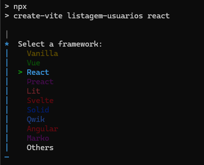
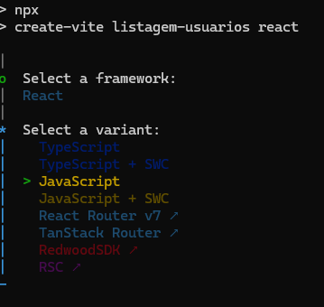
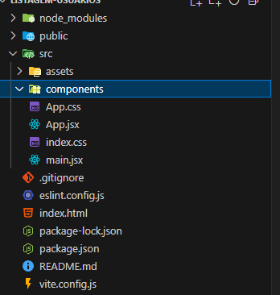
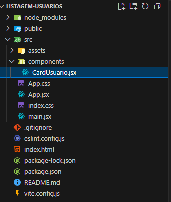
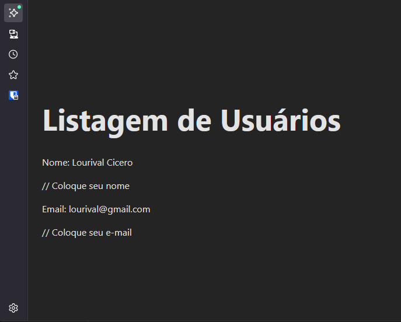

# Tutorial React - Vite

O projeto criado em nossa apostila será uma aplicação para listar usuários de uma base de dados, para isso iremos criar um projeto React, uma API em C# e realizaremos uma conexão com um banco de dados MySQL, o script da criação da tabela será disponibilizado.

Neste passo a passo vamos criar, do zero, um site **React** utilizando o **Vite** com **JavaScript puro**.  

## 1️⃣ Escolher e abrir a pasta de trabalho

1.  Escolha a pasta do seu computador onde **costuma guardar seus projetos**.  
    
2.  No **Explorador de Arquivos do Windows**, navegue até essa pasta.
    
3.  **Abra o terminal diretamente nessa pasta**:
    
    -   Segure a tecla **Shift**.
        
    -   Clique com o **botão direito do mouse** em um espaço vazio da pasta.
        
    -   Selecione **Abrir no Terminal** (ou **Abrir janela do PowerShell/Abrir no Prompt de Comando**, dependendo da versão).
        

> Isso garante que, ao rodar os comandos, o projeto será criado exatamente dentro da pasta que você escolheu para seus trabalhos.


## 2️⃣ Criar o projeto React com Vite (JavaScript)

No terminal dentro da pasta escolhida, rode:

``` bash
npm create vite@latest listagem-usuarios --template react
```

Use as teclas de navegação do teclado para ir até a opção **react**



Depois selecione a opção **Javascript**




## 3️⃣ Entrar no projeto e abrir no VS Code

Ainda no terminal, vamos executar um comando para acessar a nova paste, criada para o projeto:

``` bash
cd listagem-usuarios code .
```

> `code .` abre diretamente a pasta no **Visual Studio Code**.

## 4️⃣ Instalar as dependências

No **terminal do VS Code** (menu **Terminal → Novo Terminal**), execute:

``` bash
npm install
```

## 5️⃣ Rodar o servidor de desenvolvimento

Ainda no terminal do VS Code:

``` bash
npm run dev
```

Abra o endereço exibido no terminal, geralmente [http://localhost:5173](http://localhost:5173/).


## 6️⃣ Estruturar o projeto

### a) Criar a pasta de componentes

No VS Code, na barra lateral:

-   Clique com o botão direito em `src` → **Nova Pasta** → digite **components**.

    

### b) Criar o componente `CardUsuario`

Dentro da pasta **components**, crie o arquivo **CardUsuario.jsx** com o conteúdo:


``` typescript
function CardUsuario() {
  return (
    <div>
      <p>Nome: Lourival Cicero</p> // Coloque seu nome
      <p>Email: lourival@gmail.com</p> // Coloque seu e-mail
    </div>
  );
}

export default CardUsuario;
```




## 7️⃣ Usar o componente no App

Edite **src/App.jsx** para usar o novo componente:

``` typescript
import CardUsuario from "./components/CardUsuario";

export default function App() {
  return (
    <div style={{ fontFamily: "system-ui", padding: 24 }}>
      <h1>Listagem de Usuários</h1>
      <CardUsuario />
    </div>
  );
}

```



## Componentes em React

Os componentes são a base da arquitetura do React. Eles representam pequenas partes reutilizáveis de uma aplicação que podem ser combinadas para formar uma interface do usuário completa. Cada componente é responsável por renderizar algum aspecto da interface do usuário e gerenciar seu próprio estado interno.

Os componentes são uma das principais características do React e ajudam a manter a aplicação organizada, facilita a manutenção e torna o desenvolvimento mais eficiente. Ao dividir a interface do usuário em pequenos componentes, é possível escrever código reutilizável e testá-lo de forma independente. Além disso, os componentes podem ser atualizados individualmente sem afetar o resto da aplicação.

## JSX e sua utilização para criar elementos de interface

JSX é uma sintaxe que permite misturar HTML e JavaScript em uma única declaração. Ele é amplamente utilizado no React para criar elementos da interface de usuário. Ao invés de criar elementos HTML com JavaScript puro, você pode escrever JSX e o React cuidará da renderização desses elementos na tela.

A utilização do JSX torna a criação de elementos da interface muito mais fácil e intuitiva. Além disso, permite a passagem de valores dinâmicos como propriedades, tornando a interface mais flexível e adaptável a diferentes situações.

Ou seja, JSX é uma sintaxe que permite a criação de elementos da interface de usuário de forma mais fácil e intuitiva e torna o desenvolvimento mais eficiente e agradável. Além disso, é uma característica fundamental do React que permite passar valores dinâmicos como propriedades para os componentes.

## 8️⃣ Adicionando CSS em nosso componente

Existem diversas maneiras de trabalhar com CSS em nosso componente React como Estilização inline, bibliotecas CSS e arquivos CSS. Nessa apostila a abordagem adotada será o CSS Modules.

### O que é CSS Modules

CSS Modules é uma abordagem no desenvolvimento de aplicações React que permite o encapsulamento e modularização do CSS, evitando conflitos e promovendo uma melhor organização e reutilização dos estilos. Com o CSS Modules, cada componente tem seu próprio escopo de estilos, tornando mais fácil o desenvolvimento e manutenção de projetos, além de proporcionar uma maior legibilidade e escalabilidade no código CSS.

Utilizar CSS Modules em um componente React pode ser bem similar com utilizar CSS em um arquivo HTML, com a vantagem de que, assim como “atomizamos” os componentes HTML, também vamos deixar nossos arquivos CSS cada vez menores e com responsabilidades mais direcionadas.

Para adicionar um arquivo CSS crie um arquivo na pasta do componente que deseja estilizar, o padrão de nome que vamos adotar é nomear o arquivo CSS com o mesmo nome do componente React, seguido da palavra **module** e por fim a extensão css, tudo isso separado por pontos, como no exemplo a seguir:

`CardUsuario.module.css`

Agora vamos estilizar o componente, a sintaxe do CSS permanece a mesma que já conhecemos e trabalhamos anteriormente em PW I, aqui vai um CSS de exemplo para nosso CardUsuario.

``` css
.card {
    border: 1px solid;
    padding: 10px;
    box-shadow: 5px 10px #888888;
    width: 200px;
    margin: 10px 10px;
}
```

Criando o arquivo CSS, precisamos importar ele dentro de nosso componente JSX para declarar o seu uso, a importação desse arquivo é muito importante, pois sem ela esse CSS fica inacessível.

Para importar basta adicionar na primeira linha do arquivo JSX o seguinte código:

`import styles from "./CardUsuario.module.css"`

Com isso, criamos um objeto de importação chamado **styles** onde todas as classes CSS, criadas em nosso arquivo CSS Modules, podem ser referenciados.

### Utilizando CSS Modules

Agora com nosso CSS importado, precisamos utilizá-lo em nosso componente, seu uso é muito similar ao uso no HTML convencional, com exceção da marcação “class” e do uso do objeto **styles**.

Para utilizar uma classe no CSS como a classe “card” que criamos, você deve utilizar a marcação “className” da seguinte maneira:

``` typescript

import styles from "./CardUsuario.module.css";

function CardUsuario() {
  return (
    <div className={styles.card}>
      <p>Nome: Lourival Cicero</p>
      <p>Email: lourival@gmail.com</p>
    </div>
  );
}

export default CardUsuario;
```


Agora com o HTML e CSS em mãos, sua criatividade é ilimitada, teste estilos e componentes diferentes para criar visuais interessantes e chamativos.