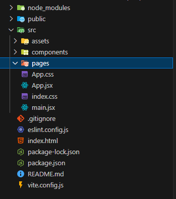
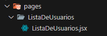
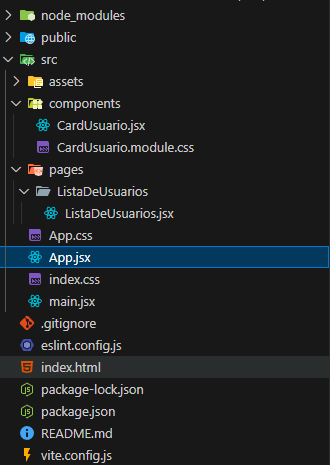
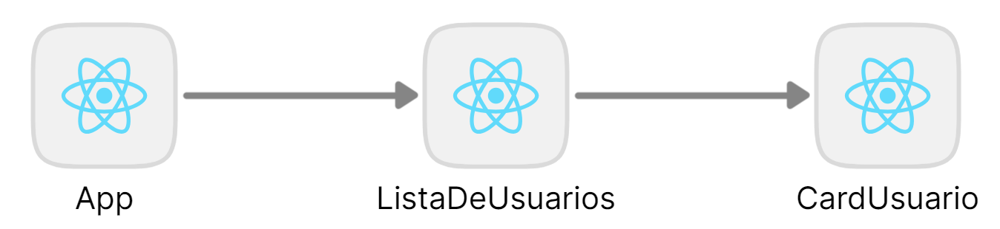
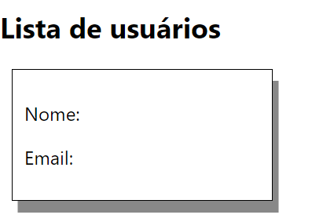
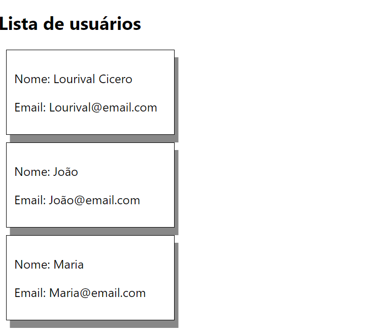

# Props e State

Neste segundo passo da nossa série, vamos aprofundar o uso do **React** entendendo o conceito fundamental chamado **props**.

Eles permitem que nossos componentes **recebam dados**

Com esse conhecimento, você poderá criar interfaces mais **dinâmicas e interativas**, tornando a aplicação **listagem-usuarios** ainda mais poderosa.

## Criando Página de Listagem

Para cada página dentro da nossa aplicação é recomendado que se crie uma pasta.

Nossa aplicação terá, a principio, uma única página, responsável por listar todos os nossos usuários, vamos chama-lá de “ListaDeUsuarios”.

Primeiro, vamos criar uma pasta chamada "Pages"

- Clique com o botão direito em `src` → **Nova Pasta** → digite **pages**.



Depois devemos criar uma pasta dentro da pasta “Pages” chamada “ListaDeUsuarios” e dentro dessa pasta um arquivo chamado “ListaDeUsuarios.jsx”



Vamos então criar o código base de um componente JSX para nossa página, adicionar um título e posteriormente preenche-lá com nossos componentes.

```JSX
import CardUsuario from '../../components/CardUsuario';

function ListaDeUsuarios() {
    return (
        <div>
          <h2>Lista de usuários</h2>
          <CardUsuario></CardUsuario>
        </div>
    );
}

export default ListaDeUsuarios;
```

## Referenciando nossa Página

No passo anterior criamos a nossa primeira página e já haviamos criado nosso componente, mas note que ainda não os utilizamos em nossa aplicação, para utilizar a página precisamos alterar o arquivo raiz e “chamar” esta página.

Vamos até o arquivo App.Js, localizado na raiz da pasta “src”



Altere o código para ficar dessa maneira:

``` ts
import ListaDeUsuarios from "./pages/ListaDeUsuarios/ListaDeUsuarios";

export default function App() {
  return (
    <div style={{ fontFamily: "system-ui", padding: 24 }}>
      <ListaDeUsuarios></ListaDeUsuarios>
    </div>
  );
}

```

Com isso, agora ao invés de referenciar o componente, vamos refêrenciar nossa página que exibirá o componente (ou um conjunto deles).

Gosto de pensar que criar componentes React com JSX é como criar minhas próprias tags HTML, porém com muito mais ações, estilos e consequentemente muito mais possibilidades.

Então podemos entender que nossa página “ListaDeUsuarios” é uma nova tag e ao referenciá-la em nosso código, exibiremos a nossa página de listagem de usuários, que por enquanto contém somente o título da página e um componente de Card.


## Transportando dados para nosso componente (props)

### Hierarquia de componentes

Para falar de props e transporte de dados precisamos antes falar mais sobre nossa arquitetura. Na arquitetura de componentes do React, os componentes podem ser organizados em hierarquia, onde um componente pai pode conter vários componentes filhos. Cada componente é responsável por renderizar uma parte da interface do usuário e gerenciar seu próprio estado.

A hierarquia de componentes permite que você divida sua interface do usuário em partes menores e reutilizáveis, o que torna o desenvolvimento de aplicativos mais fácil e escalável. Além disso, também facilita a manutenção do código, já que você pode atualizar ou corrigir uma parte específica da interface do usuário sem afetar o resto da aplicação.

Hoje nossa hierarquia de componentes hoje está desenhada da seguinte forma:



Ou seja, o componente App.JSX é pai da página ListaDeUsuarios.JSX, que por sua vez é pai do componente CardUsuario.JSX.

### O que são as Props

Props em React é uma abreviação para "propriedades". É utilizado para passar dados de um componente pai para um componente filho. Props são imutáveis, ou seja, uma vez que são definidos, eles não podem ser alterados pelo componente filho. Eles funcionam como argumentos passados para uma função, onde o componente pai passa valores para as props e o componente filho os recebe como argumentos. Props são usados para compartilhar informações entre componentes e garantir que a interface do usuário seja renderizada corretamente.

Podemos imaginar o nosso componente React como uma espécie de formulário em branco, que precisa ser preenchido com dados dinâmicos, para preencher esses dados em branco o componente pai, ao chamar o componente filho, passa os dados via props.

Podemos enxergar as propriedades do componente como variáveis, assim, o componente exibirá dados dinâmicos, mudando de acordo com o que nós desejamos.
Essa explicação mais abstrata pode ficar mais objetiva se trabalharmos com exemplos reais.

### Exemplo de Props

Para configurar nosso componente filho para receber props precisamos especificar quais propriedades o componente precisa para funcionar. No caso do componente CardUsuario temos apenas duas propriedades: nome e email.

Para adicionar as propriedades basta adicionar os nomes no espaço para parâmetros de nosso componente (parenteses), como o código a seguir:

```JSX
import styles from "./CardUsuario.module.css";

function CardUsuario({nome, email}) {
  return (
    <div className={styles.card}>
      <p>Nome: Lourival Cicero</p>
      <p>Email: lourival@gmail.com</p>
    </div>
  );
}

export default CardUsuario;

```

Pronto! Nosso componente tem propriedades vindas do componente pai para o componente filho, mas ainda não estamos utilizando essas propriedades da forma adequada.

Como dito anteriormente, podemos enxergar as propriedades do componente como variáveis, assim, o componente exibirá dados dinâmicos, mudando de acordo com o que nós desejamos.

Para utilizar essas propriedades de nome e email precisamos fazer com o que nosso HTML dentro do JSX chame esses dados. Para isso, coloque o nome da variável entre chaves e o valor desse dado será apresentado na tela.

```JSX
import styles from "./CardUsuario.module.css";

function CardUsuario({nome, email}) {
  return (
    <div className={styles.card}>
      <p>Nome: {nome}</p>
      <p>Email: {email}</p>
    </div>
  );
}

export default CardUsuario;
```

Note que agora que nosso componente está dinâmico, sua aparência se assemelha à um formulário em branco, esperando para ser preenchido.



Ao falar sobre props, mencionamos que o componente pai é o responsável de passar os dados para o componente filho, ou seja, para adicionar dados em nosso componente, precisamos acessar o componente pai e fazer a alteração necessária.

No momento, o componente pai de nosso componente CardUsuario é a página ListaDeUsuarios.JSX, como vimos na imagem a seguir:


### Utilizando Props

Precisamos então acessar a página ListaDeUsuarios.JSX e na linha onde chamamos o componente CardUsuario precisamos fazer a devida alteração.

Adicionar propriedades em um componente filho é bem similar ao que utilizamos para passar alguns dados ou configurações para componentes HTML, por exemplo a propriedade Source (ou src) de uma tag IMG do HTML é escrita da seguinte forma:

```HTML

```

Para adicionar um dado nas propriedades de nosso componente não é muito diferente, basta adicionar o nome da propriedade e o valor desejado como na imagem a seguir:

```JSX
import CardUsuario from '../../components/CardUsuario';

function ListaDeUsuarios() {
    return (
        <div>
            <h2>Lista de usuários</h2>
            <CardUsuario nome="Lourival Cicero" email="lourival@gmail.com"></CardUsuario>
        </div>
    );
}

export default ListaDeUsuarios;


```

Ao acessar novamente nosso site no navegador você deve notar que nosso card voltou a estar preenchido com os dados que adicionamos.


Mas existe agora uma grande diferença entre nosso antigo componente e o componente atual: Nosso componente é dinâmico, ou seja, podemos criar vários componentes iguais, mas com nomes e emails diferentes:

```JSX
import CardUsuario from '../../components/CardUsuario';

function ListaDeUsuarios() {
    return (
        <div>
            <h2>Lista de usuários</h2>
            <CardUsuario nome="Lourival Cicero" email="Lourival@email.com"></CardUsuario>
            <CardUsuario nome="João" email="João@email.com"></CardUsuario>
            <CardUsuario nome="Maria" email="Maria@email.com"></CardUsuario>
        </div>
    );
}

export default ListaDeUsuarios;
```



Com isso, temos uma estrutura básica em nosso front-end para criar uma listagem de usuários dinâmicas com dados de usuários preenchidos com informações do banco de dados, mas para isso, precisamos criar nosso back-end e realizar a integração de nossas aplicações.
