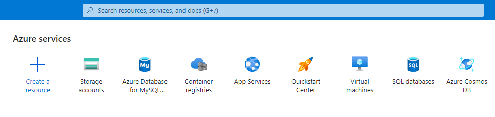
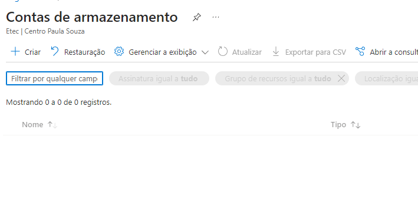
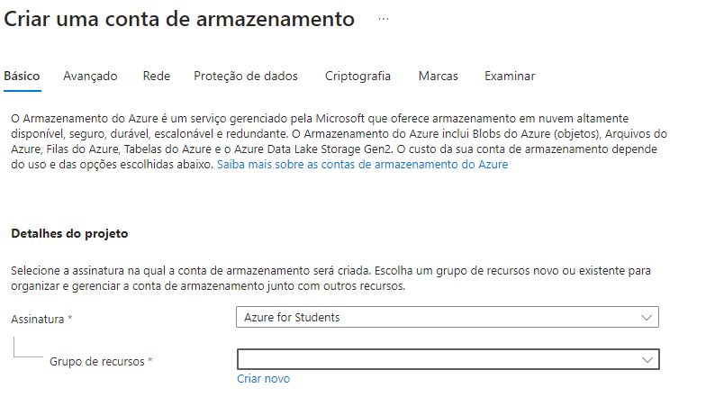
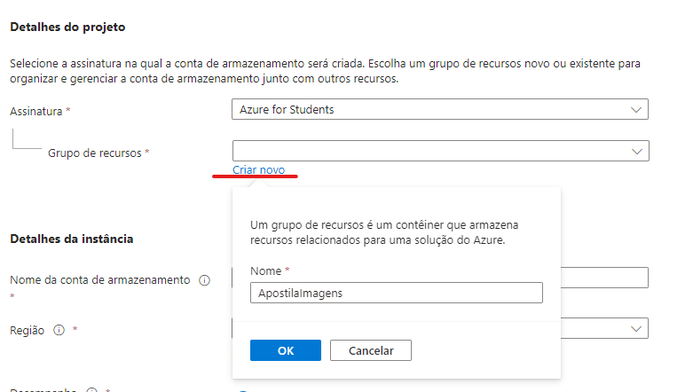
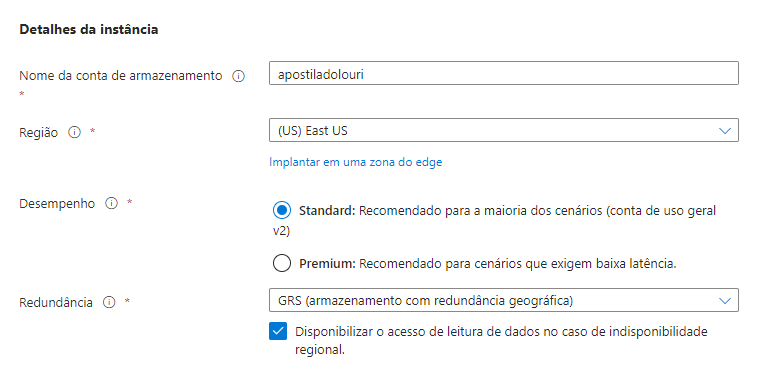
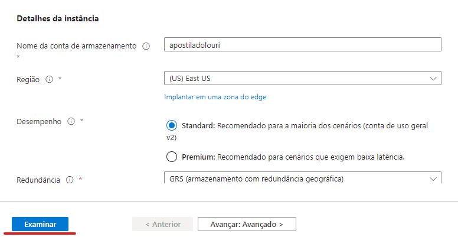

# Criando Imagens Públicas na Azure

O Microsoft Azure fornece uma plataforma robusta para armazenar e gerenciar seus dados na nuvem. Uma das maneiras mais comuns de usar o Azure é armazenar e compartilhar imagens. Este tutorial mostrará como criar um Azure Storage Account, criar um contêiner de blob para armazenamento e, em seguida, fazer upload de imagens para esse contêiner. 

## Criando um Storage Account (Conta de Armazenamento)

Acesse o portal da azure com sua conta de estudante

Depois, pesquise na barra de recursos por Storage Accounts ou Contas de Armazenamento, dependendo do idioma configurado em sua conta.

Ao navegar à tela de Contas de armazenamento, crie um novo clicando na opção create (ou criar) no canto superior esquerdo

Você então sera redirecionado à página de criação de um Storage Account

Na opção Grupos de Armazenamento você pode criar um novo caso ainda não tenha criado nenhum grupo anteriormente, ou pode reutilizar um criado previamente.

Para criar um novo basta clicar na opção "Criar Novo" e preencher com o nome de seu projeto

Na opção **Detalhes da instância** você deve criar um nome de armazenamento único, que será utilizado na URL de acesso à sua imagem.

Depois disso clique em **Examinar** no rodapé à esquerda

Por fim clique em **Criar**