# Criando Imagens Públicas na Azure

O Microsoft Azure fornece uma plataforma robusta para armazenar e gerenciar seus dados na nuvem. 

Este tutorial mostrará como criar um Azure Storage Account, criar um contêiner de blob para armazenamento e, em seguida, fazer upload de imagens para esse contêiner. 

## Criando um Storage Account (Conta de Armazenamento)

Acesse o portal da azure com sua conta de estudante

Depois, pesquise na barra de recursos por Storage Accounts ou Contas de Armazenamento, dependendo do idioma configurado em sua conta.

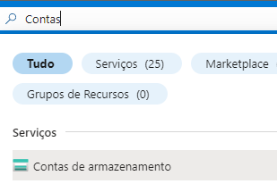

Ao navegar à tela de Contas de armazenamento, crie um novo clicando na opção create (ou criar) no canto superior esquerdo

Você então sera redirecionado à página de criação de um Storage Account

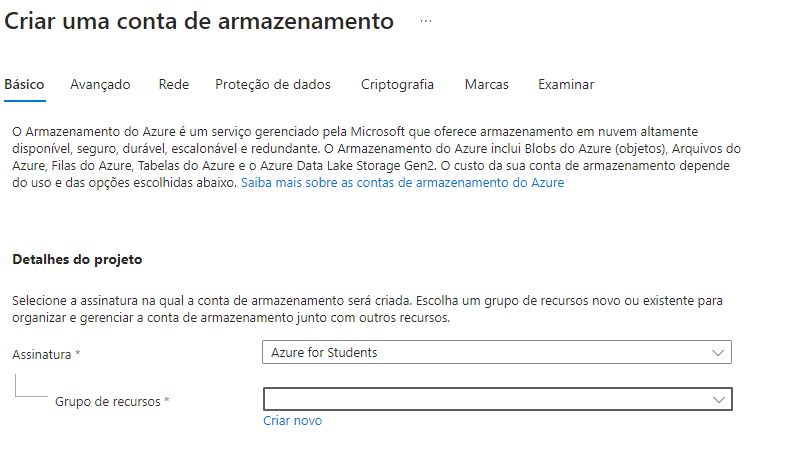

Na opção Grupos de Armazenamento você pode criar um novo caso ainda não tenha criado nenhum grupo anteriormente, ou pode reutilizar um criado previamente.

Para criar um novo basta clicar na opção "Criar Novo" e preencher com o nome de seu projeto

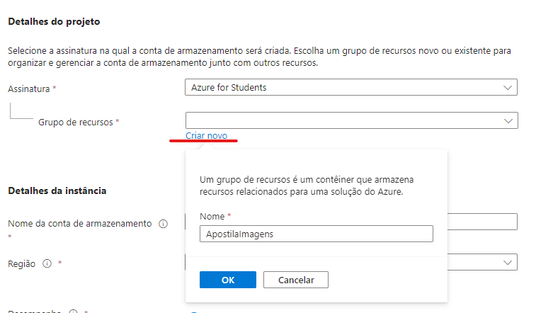

Na opção **Detalhes da instância** você deve criar um nome de armazenamento único, que será utilizado na URL de acesso à sua imagem.

Agora, navegue para o menu "Avançado", para configurarmos a segurança de nossas imagens.

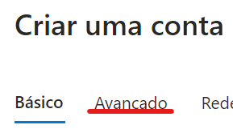

Depois, na opção **Segurança**, marque a opção **Permitir a habilitação do acesso anônimo em contêineres individuais*.

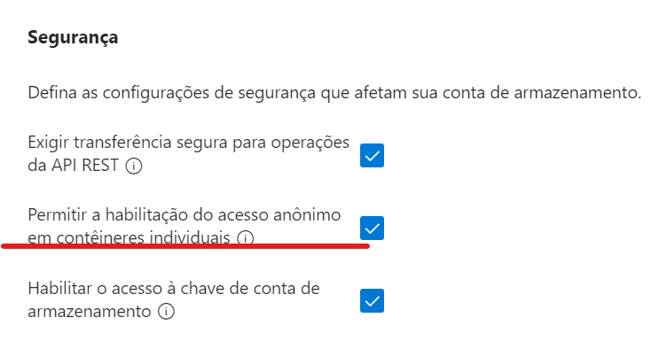

Depois disso clique em **Examinar** no rodapé à esquerda

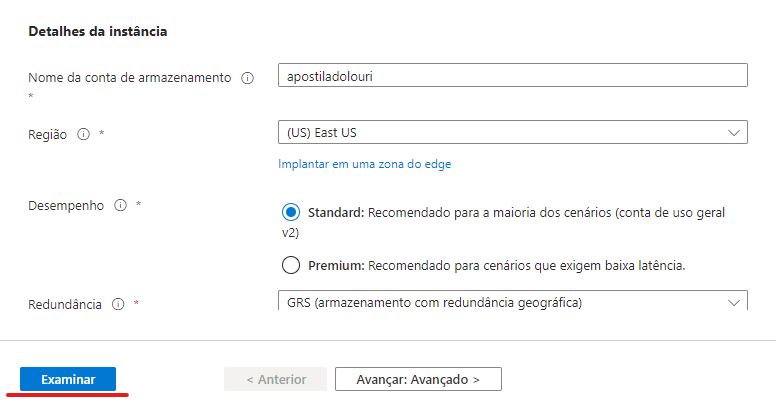

Por fim, quando disponível, clique em **Criar** também no rodapé à esquerda.

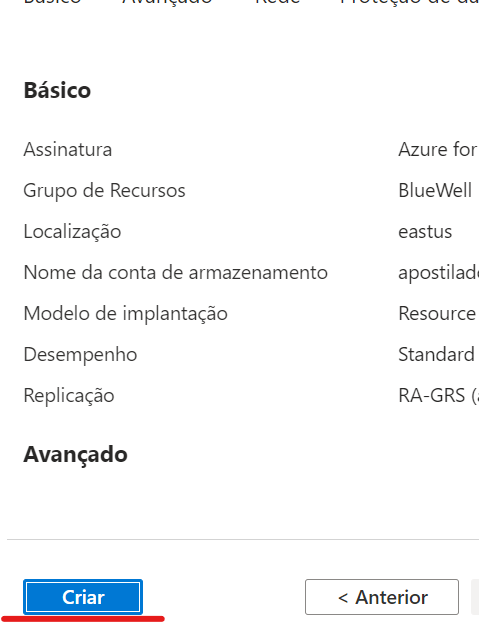

Você será redirecionado para uma página de implantação, aguarde a conclusão e clique em "Ir para o recurso"

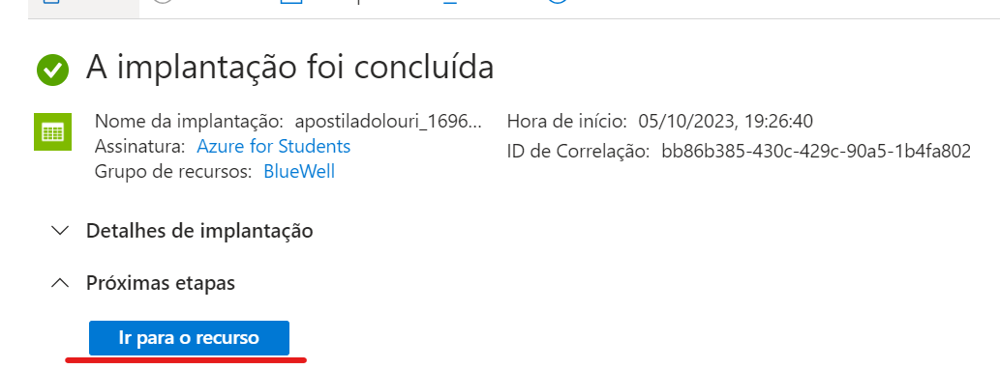

Pronto! Ao seguir esse processo você criou a sua Conta de Armazenamento e deve ver uma tela como a tela a seguir:

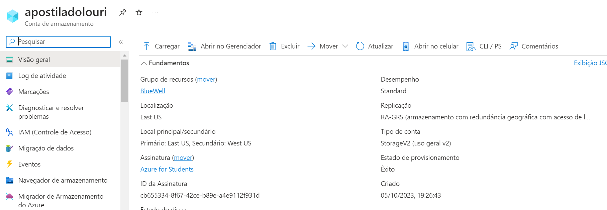

## Configurando acesso público à Conta de Armazenamento

Precisamos configurar o acesso anônimo para nossas imagens, para isso, acesse a opção de configurações no menu lateral à esquerda:

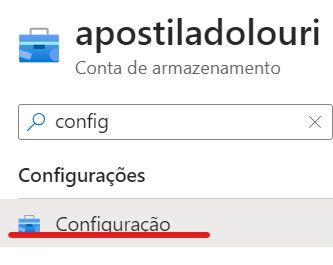

Depois, caso esteja deselecionado, selecione a opção "Permitir acesso anônimo ao Blob"

*Antes*

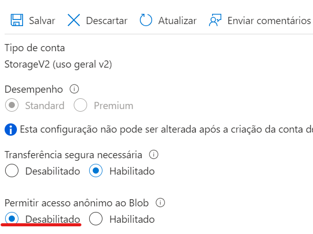

*Depois*

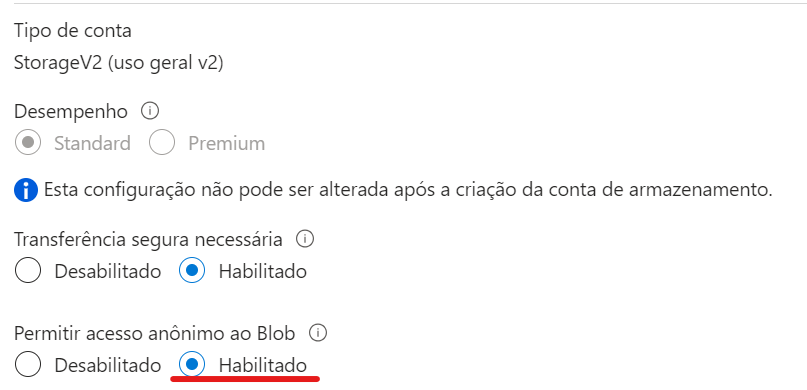

Por fim, clique em salvar no menu superior

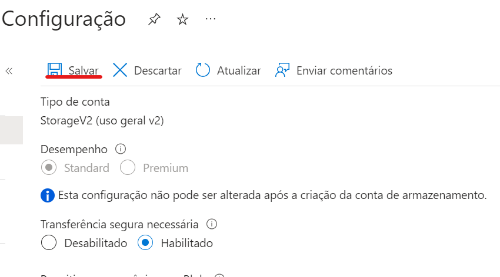

## Criando um Blob Container

No contexto de um Azure Storage Account, um Blob Container (Contêiner de Blob) é um recipiente lógico usado para organizar e armazenar objetos binários, conhecidos como "blobs". 

Esses blobs podem ser arquivos binários, como imagens, vídeos, documentos, backups, ou qualquer outro tipo de dados não estruturados que você deseja armazenar na nuvem.

*Em resumo, podemos entender um container na Conta de Armazenamento como a pasta onde de fato nossos arquivos estarão hospedados*.

Para criar um container, pesquise no menu lateral por Container e acesse sua opção.

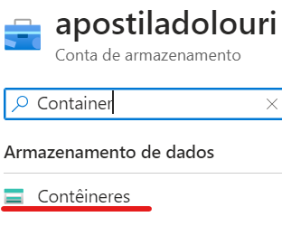

Ao ser redirecionado à tela de Container, clique na opção de adicionar Container

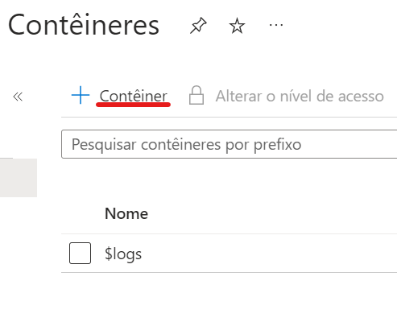

No menu lateral que abrir, escolha um nome para seu container, esse nome pode ser o nome do seu projeto mesmo, e selecione o nível de acesso **Blob** e clique em criar

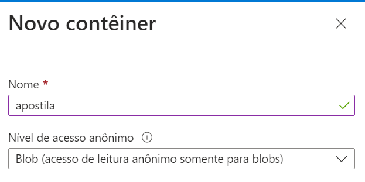

Quando seu container for criado, você deverá ver a tela a seguir

## Subindo uma imagem via Azure

Acesse o container criado no passo anterior

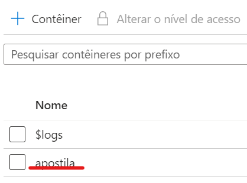

Na tela seguinte clique na opção **Caregar**

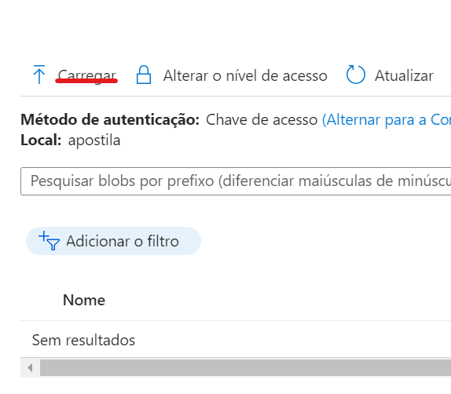

No menu lateral, selecione a imagem desejada e clique em carregar.

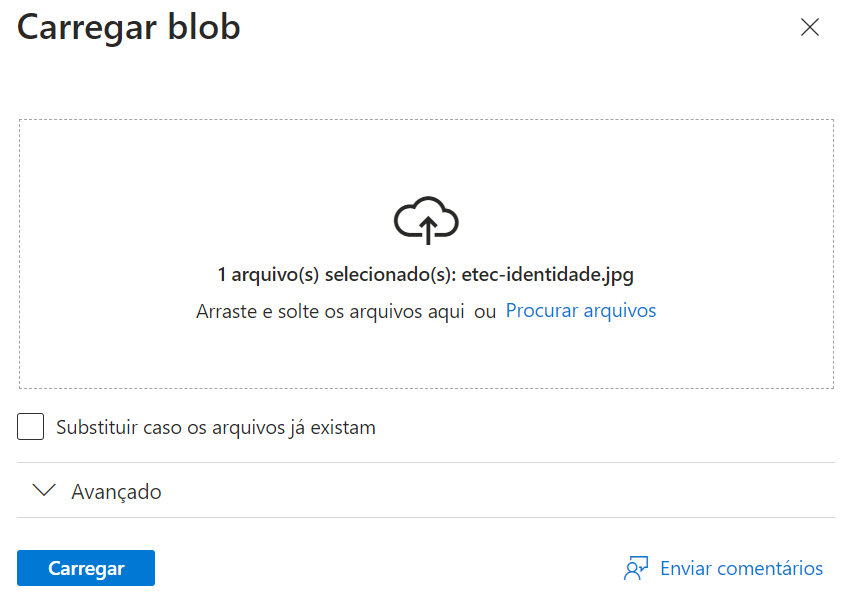

A imagem carregada deve apeser na listagem do container

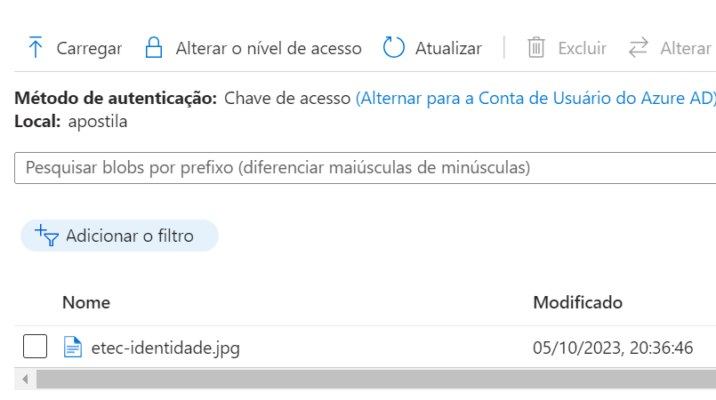

**Pronto**, sua imagem está criada na nuvem e pronta para acessar de qualquer lugar.

Para pegar sua URL, clique na imagem e no menu que abrir você podera ver e copiar a URL criada

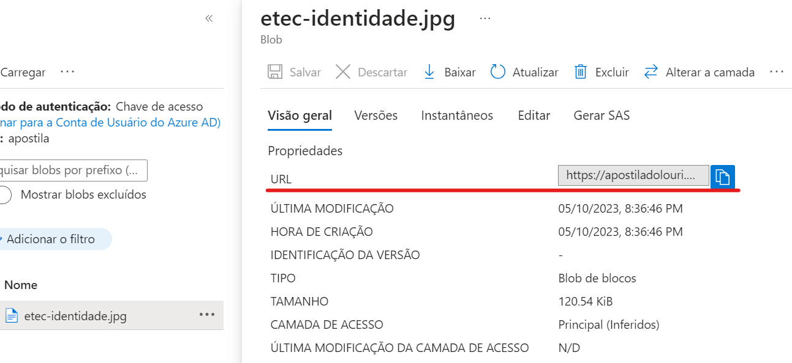

Ao copiar a URL e acessar no navegador, você poderá ver a sua imagem

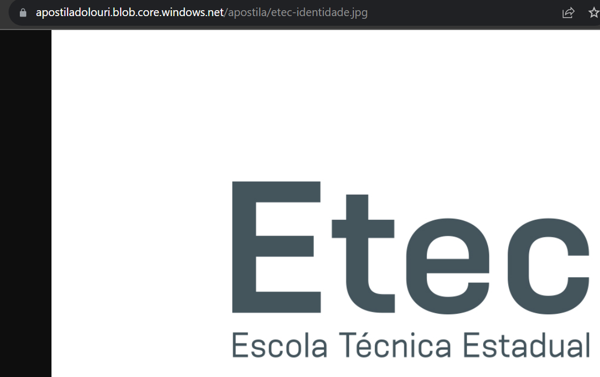